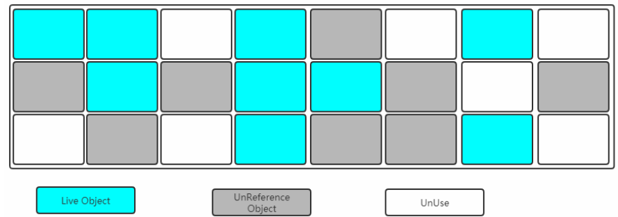
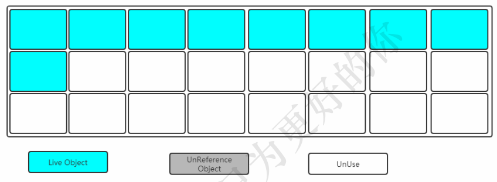
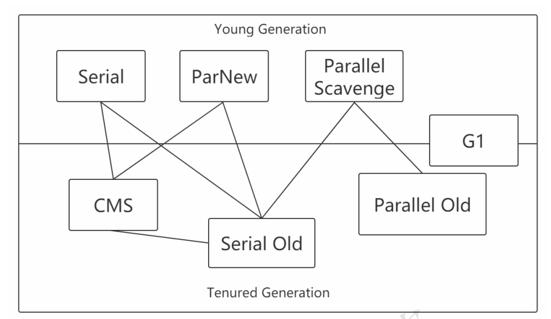
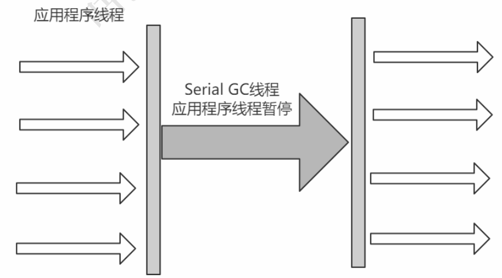
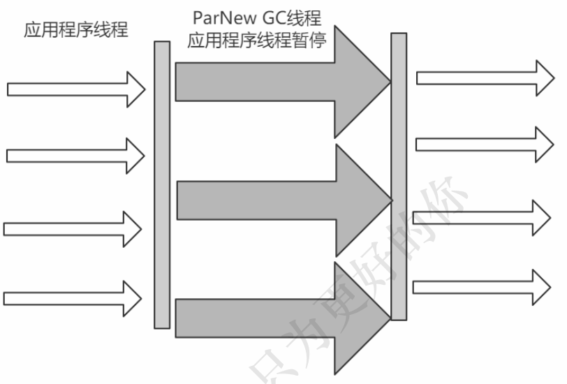
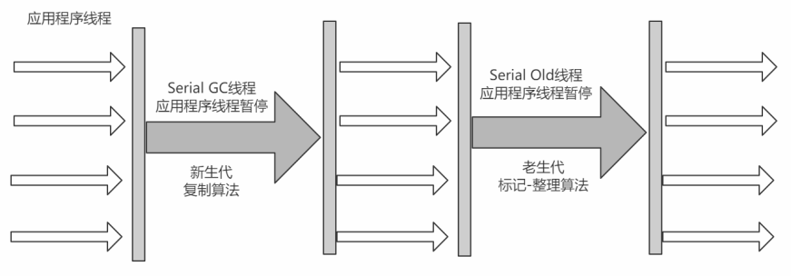
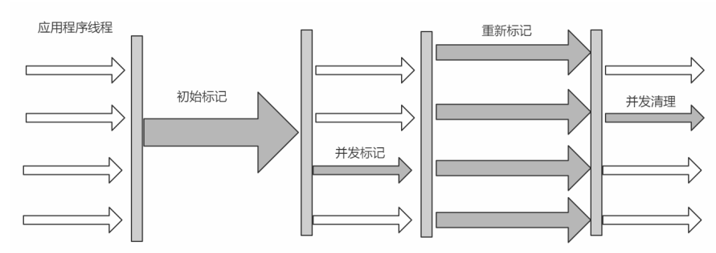
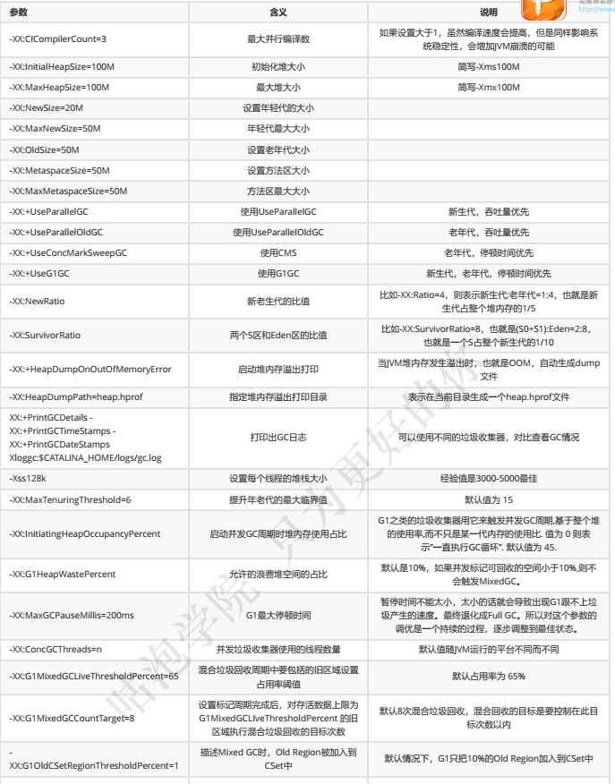

## JVM

### 1. 类加载机制

#### 1.1装载（Load）

查找和导入class文件

* 通过类的全限定名获取定义此类的二进制字节流
* 将这个字节流所代表的静态存储结构转化为方法区的运行时数据结构
* 在堆中生成一个代表这类的java.lang.Class对象，作为对方法区中这些数据的方法入口

#### 1.2链接（Link）

##### 1.2.1验证（Verify）

保证被加载的类的正确性

* 元数据验证
* 文件格式验证
* 字节码验证
* 符号引用验证

##### 1.2.2准备(Prepare)

为类的静态变量分配内存，并将其初始化为默认值

##### 1.2.3解析（Resolve）

将类中的符号引用转换为直接引用

#### 1.3初始化（Initialize）

对类的静态变量，静态代码块执行初始化操作

### 2.类加载器

#### 2.1分类

| 名称                  | 加载范围                                                     |
| --------------------- | ------------------------------------------------------------ |
| BootStrap ClassLoader | $JAVA_HOME中jre/lib/rt.jar所有class或Xbootclasspath选项指定的jar包。由c++实现，不是ClassLoader的子类 |
| Extension ClassLoader | java平台中扩展功能的一些jar包，包括$JAVA_HOME中jre/lib*.jar或-Djava.ext.dirs指定目录下的jar包 |
| App ClassLoader       | classpath下指定的jar包及Djava.class.path指定目录下的类和jar包 |
| Custom ClassLoader    | 通过java.lang.ClassLoader子类自定义加载class，应用程序根据自身需要自定义的ClassLoader |

#### 2.2加载原则

检查某个类是否已经被加载，顺序是自底向上，从Custom ClassLoader到Bootstrap ClassLoader逐层检查，如果某个ClassLoader已加载，就视为此类已加载，保证此类只被所有ClassLoader加载一次

**双亲委派机制**

> 当一个类加载器接收到加载类的请求时，首先不会自己尝试去加载这个类，而是把这个加载请求委托给父类加载器去加载，依次递归，如果父类加载器可以完成类加载任务，就成功返回；只有父类加载器无法完成加载任务时，才自己去加载

优势

> 比如rt.jar中的Object类，无论哪个加载器去加载这个类，最终都是委托给Bootstrap ClassLoader加载，因此Object在各个类加载环境中都是同一个类。如果不采用双亲委派模型，那么系统中会存在多种不同的Object类

破坏

> 继承ClassLoader类，重写loadClass方法

### 3. 运行时数据区


#### 3.1Method Area（方法区）

所有线程共享的内存区域，在虚拟机启动时创建。

用于存储已被虚拟机加载的类的信息、常量、静态变量、即时编译器编译后的代码等数据

方法区在JDK8中是Metaspace，在JDK6,7中是Perm Space

**运行时常量池（Run-Time Constant Poll）**

Class文件中除了有类的版本、字段、方法、接口等描述信息外，还有一项就是常量池，用于存放编译时间生成的各种字面量和符号引用，这部分内容将在类加载后进入方法区中的运行时常量池中存放

#### 3.2Heap（堆）

Java堆是Java虚拟机所管理内存中最大的一块，在虚拟机启动时创建，所有线程共享。

Java对象实例以及数组都在堆上分配

#### 3.3 JVM Stacks（java虚拟机栈）

虚拟机栈是一个线程执行的区域，保存着一个线程中方法的执行状态。换句话说，一个java线程的运行状态，由一个虚拟机栈来保存，虚拟机栈是线程独有的，随着线程的创建而创建。

每一个被线程执行的方法，为虚拟机栈中的一个栈帧。调用一个方法时，向栈中压入一个栈帧，一个方法调用完成，就会把该栈帧从栈中弹出

#### 3.4 The pc Register（程序计数器）

一个线程是否拥有执行权，是由cpu的调度决定的，在一个线程的执行过程中，一般会伴随着多次cpu时间片的切换，当一个线程再次获得cpu时间片时，需要从上一次执行的位置继续执行，程序计数器就是用来记录程序执行的位置

当线程正在执行java代码时，该计数器记录的是正在执行的虚拟机字节码指令的位置。

如果正在执行的是native方法，则这个计数器为空。

### 4. 虚拟机栈帧


* 局部变量表

  > 方法中定义的局部变量和方法参数存放在这张表中，局部变量表中的变量不可以直接使用，必须通过相关指令将其加载至操作数栈中作为操作数使用

* 操作数栈

  > 以压栈和出栈方式存储操作数

* 动态链接

  > 每个栈帧都包含一个指向运行时常量池中该栈帧所属方法的引用，持有此引用是为了支持方法调用过程中的动态链接

* 方法返回地址

  > 当一个方法开始执行后，只有两种方式可以退出，一种是遇到方法返回的字节码指令；一种是遇到异常，且这个异常没有在方法内得到处理

#### 4.2 栈指向堆

> Object obj=new Object()  时，栈中元素指向堆中元素


#### 4.3 方法区指向堆

`private static Object obj=new Object();`  


#### 4.4 堆指向方法区


### Java对象内存布局

一个java对象在内存中包括3部分

* 对象头
* 实例数据
* 对齐填充


### 堆内存


**Eden:S1:S2 = 8：1：1**  

#### 对象创建所在区域

一般情况下，新创建的对象会被分配到Eden去，一些特殊的大对象会直接分配到Old区

> 比如对象A, B, C 在Eden区创建，当Eden区被填满或达到一个设定的阈值后，需要对Eden区内存空间进行清理，即垃圾收集（Garbage Collect），这种的GC称为Minor GC，Minor GC值Young区的GC
>
> 一次GC之后，有些对象会被清理掉，有些对象可能还存活着，存活着的对象需要将其复制到Survivor区，然后再清空Eden区的这些对象

#### Survivor区详解

survivor区属于Young区的一部分，survivor分为两部分，S0和S1，在同一时刻，S0和S1只有一个有数据，另一个是空的

> 接着上面的GC来说，比如一开始Eden区中From有对象，To是空的
>
> 此时进行一次GC，From区中的对象的年龄+1，Eden区中所有存活的对象会被赋值到To区，From区中还能存活的对象有2个去处：若对象年龄未达到设置的阈值，会被移动到To区，如果达到设定的阈值，会被移动到Old区。此时，Eden区和From区都会被清空。
>
> From和To互换角色
>
> Minor GC会一直重复这样的过程，直到To区被填满，然后将所有对象复制到老年代中。晋升年龄阈值”通过参数MaxTenuringThreshold设定，默认值为15。

#### Old区

Old区的GC称为Major GC，常常触发Full GC。

#### 为什么需要Survivor区?只有Eden不行吗？  

如果没有Survivor，也就是对象没有年龄之分，Eden区每进行一次Minor GC，存活的对象都被送到Old区，导致Old区很快被填满，触发Major GC（一般也伴随着Full GC），Old区内存空间远大于Young区，GC耗时很大，影响程序相应时间。如果将Eden区和Old区看做对象存在的两种状态，Survivor就是给对象增加了一个中间状态，使对象不太容易进入Old区，进而尽量少执行Major GC。

如果增大Old区空间，Major GC频率会减少，但是一旦发生Major GC，执行时间会更长，也会导致Young区变小，Minor GC更频繁，Old区对象增加速度会变快。

假如减少老年代空间，虽然Full GC所需时间减少，但是老年代很快被存活对象填满,Full GC频率增加。  

#### 为什么需要2个Survivor？

解决内存碎片问题，随机IO变为连续IO

### 垃圾回收

#### 可达性分析

通过GC Root对象，开始向下查找，看某个对象是否可达

**GC Root**

> 类加载器、Thread、虚拟机栈的本地变量表、static变量、常量引用、本地方法栈的变量等

#### 垃圾收集算法

##### 标记-清理（Mark-Sweep）

* 标记：找出内存中需要回收的对象，把他们标记出来

  

* 清除：清除被标记的对象，释放对应内存空间


**缺点**

> 标记和清理两个过程都比较耗时，效率不高
>
> 会产生内存碎片，可能导致需要分配较大对象时，无法找到足够的连续内存而不得不提前触发一次GC

##### 复制（Copying）

将内存划分为2个相等的区域，每次只适用其中一块，如下图


当其中一块内存使用完了，就将还存活的对象复制到另外一块上面，然后把已经使用过的内存空间一次
清除掉  。


缺点：空间利用率低。

##### 标记-整理(Mark-Compact)  

与标记-清理类似，但是后续步骤不是直接对可回收对象进行清理，而是让所有存活对象都向一端移动，然后直接清理掉存活对象边界以外的内存。



让所有存活的对象都向一端移动，清理掉边界以外的内存  



#### 分代收集算法

* Young区：复制算法(对象在被分配之后，可能生命周期比较短，Young区复制效率比较高)
* Old区：标记清除或标记整理(Old区对象存活时间比较长，复制来复制去没必要，不如做个标记再清理)  

#### 垃圾收集器



##### Serial收集器  

最基本、历史最悠久的收集器（单线程）。曾经（在JDK1.3.1之前）是虚拟机新生代收集的唯一选择 。

> 优点：简单高效，拥有很高的单线程收集效率
> 缺点：收集过程需要暂停所有线程
> 算法：复制算法
> 适用范围：新生代
> 应用：Client模式下的默认新生代收集器  



##### ParNew收集器  

可以看做是Serial收集器的多线程版本

> 优点：在多CPU时，比Serial效率高。
> 缺点：收集过程暂停所有应用程序线程，单CPU时比Serial效率差。
> 算法：复制算法
> 适用范围：新生代
> 应用：运行在Server模式下的虚拟机中首选的新生代收集器  



##### Parallel Scavenge收集器  

使用复制算法的新生代收集器，并行多线程收集器，更关注系统的**吞吐量**。

> 吞吐量=运行用户代码的时间/(运行用户代码的时间+垃圾收集时间)
> 比如虚拟机总共运行了100分钟，垃圾收集时间用了1分钟，吞吐量=(100-1)/100=99%。
> 若吞吐量越大，意味着垃圾收集的时间越短，则用户代码可以充分利用CPU资源，尽快完成程序
> 的运算任务。  

```shell
-XX:MaxGCPauseMillis  #控制最大的垃圾收集停顿时间，
-XX:GCTimeRatio       #直接设置吞吐量的大小。
```

##### Serial Old收集器  

Serial收集器的老年代版本，采用**标记-整理**算法



##### Parallel Old收集器  

Parallel Scavenge收集器的老年代版本，采用**标记整理**算法

##### CMS收集器  

CMS(Concurrent Mark Sweep)收集器是一种以获取 **最短回收停顿时间** 为目标的老年代收集器。

采用**标记整理**算法，分为4步：

> （1）初始标记：标记GC Roots能**直接关联**的对象，速度很快  STW
>
> （2）并发标记：GC Roots Tracing，标记上一步标记的对象所关联的对象
>
> （3）重新标记：重新标记上一步并发标记时，用户线程变动的内容
>
> （4）并发清理


> 由于整个过程中，并发标记和并发清除，收集器线程可以与用户线程一起工作，所以总体上来
> 说，CMS收集器的内存回收过程是与用户线程一起并发地执行的  


> 优点：并发收集、低停顿
> 缺点：产生大量空间碎片、并发阶段会降低吞吐量  



##### G1收集器  


#### 垃圾收集器分类  

* 串行收集器：Serial和Serial Old  

* 并行收集器[吞吐量优先]：Parallel Scanvenge、Parallel Old  

  > 多条垃圾收集线程并行工作，但此时用户线程仍然处于等待状态。 适用于科学计算、后台处理等若交互场
  > 景   

* 并发收集器[停顿时间优先]：CMS、G1  

  > 用户线程和垃圾收集线程同时执行(但并不一定是并行的，可能是交替执行的)，垃圾收集线程在执行的
  > 时候不会停顿用户线程的运行。 适用于相对时间有要求的场景，比如Web  

#### 吞吐量和停顿时间  

* 停顿时间：垃圾收集器 进行 垃圾回收中断应用执行响应的时间

  > 停顿时间越短就越适合需要和用户交互的程序，良好的响应速度能提升用户体验  

* 吞吐量：运行用户代码时间/(运行用户代码时间+垃圾收集时间)  

  > 高吞吐量则可以高效地利用CPU时间，尽快完成程序的运算任务，主要适合在后台运算而不需要太多交互的任
  > 务  

**这两个指标也是评价垃圾回收器好处的标准，其实调优也就是在观察这两个变量**  

### 开启需要的垃圾收集器  

> （1）串行
> 		-XX：+UseSerialGC
> 		-XX：+UseSerialOldGC
> （2）并行(吞吐量优先)：
> 		-XX：+UseParallelGC
> 		-XX：+UseParallelOldGC
> （3）并发收集器(响应时间优先)
> 		-XX：+UseConcMarkSweepGC
> 		-XX：+UseG1GC  


#### JVM参数分类

* **标准参数：**jdk所有版本基本不变的参数

  * -version
  * -help

* **-X参数：**非标准参数，不同jdk版本可能有改动

  * -Xint    解释执行
  * -Xcomp  第一次使用就编译成本地代码
  * -Xmixed  混合模式，jvm自己来决定

* **-XX参数：**使用最多的参数，相对不稳定，主要用于JVM调优及debug

  * bool类型：
    * 格式：-XX [+-] <name>        +-表示启用或禁用name属性
    * -XX:+UseConcMarkSweepGC 表示启用CMS类型的垃圾回收器
    * -XX:+UseG1GC 表示启用G1类型的垃圾回收器
  * 键值对类型：
    * 格式：-XX<name>=<value>
    * -XX:MaxGCPauseMillis=500

* **其他参数：**其实也是XX类型参数

  > -Xms1000等价于-XX:InitialHeapSize=1000          初始值默认物理内存的1/16
  >
  > -Xmx1000等价于-XX:MaxHeapSize=1000            初始值默认为物理内存的1/4
  > -Xss100等价于-XX:ThreadStackSize=100


#### JVM常用参数

* **Xms：**初始化堆内存大小，默认是物理内存的1/64；**等价于 -XX:initialHeapSize**
* **Xmx：**最大堆内存大小，默认是物理内存的1/4；  **等价于 -XX:MaxHeapSize**
* **Xss：**单个线程栈大小，一般默认1024k，但是如果你没有设置，获取到的值是0，表示默认;                  **等价于  -XX:ThreadStackSize**
* **Xmn：**年轻代空间大小
* **-XX:MetaspaceSize：**非堆，方法区最大大小，元空间不在虚拟机中，默认情况下，仅受本地内存限制
* **-XX:PrintGCDetails：**打印GC日志
* **-XX:SurvivorRatio：**新生代中Eden区和S0/S1的比例，默认8:1:1, 即 XX:SurvivorRatio=8
* **-XX:NewRatio：**新老生代比例，默认2，即Old Area：Young Area=2，年轻代占堆内存的1/3
* **-XX:MaxTenuringThreshold：**对象从Young区移动至Old区需要经历的GC次数，默认15，自定义范围是 0-15


#### 查看参数

> java -XX:+PrintFlagsFinal -version > flags.txt

#### 设置参数的方式

* 开发工具中设置比如IDEA，eclipse
* 运行jar包的时候:java -XX:+UseG1GC xxx.jar
* web容器比如tomcat，可以在脚本中的进行设置
* 通过jinfo实时调整某个java进程的参数(参数只有被标记为manageable的flags可以被实时修改)

常用参数：




#### JVM常用命令

* jps -l    ：         查看java进程

* jinfo：实时查看和调整jvm参数

  * 查看：

    `jinfo -flag name PID`

    如：

    ```shell
    jinfo -flag MaxHeapSize PID
    jinfo -flag UseG1GC PID
    ```

  * 修改：只有标记为manageable的flag可以动态修改

    `jinfo -flag [+|-] PID`
    `jinfo -flag = PID`

  * 查看曾经赋值过的一些参数

    `jinfo -flags PID`  

* jstat：查看虚拟机统计信息

  * 查看类装载信息

    `jstat -class PID 1000 10` 查看某个java进程的类装载信息，每1000毫秒输出一次，共输出10次  

  * 查看垃圾回收信息

    `jstat -gc PID 1000 10`

* jstack：查看堆栈信息

  * jstack PID

* jmap：生成存储快照（The jmap command prints shared object memory maps or heap memory details of a
  specified process, core file, or remote debug server）

  * 打印堆内存相关信息

    ```shell
    -XX:+PrintFlagsFinal -Xms300M -Xmx300M
    jmap -heap PID
    ```

  * dump堆内存信息

    `jmap -dump:format=b,file=heap.hprof PID`  

  * 堆内存溢出时，自动dump

    `-XX:+HeapDumpOnOutOfMemoryError -XX:HeapDumpPath=heap.hprof`

#### JVM工具

* jconsole：

* jvisualvm

  * java进程的cpu，类，线程

* Arthas

  > curl -O https://alibaba.github.io/arthas/arthas-boot.jar
  > java -jar arthas-boot.jar
  > \# 然后可以选择一个Java进程  

* MAT：Java堆分析器，用于查找内存泄漏

  * dump信息内容

    > All Objects
    > 	Class, fields, primitive values and references
    > All Classes
    > 	Classloader, name, super class, static fields
    > Garbage Collection Roots
    > 	Objects defined to be reachable by the JVM
    > Thread Stacks and Local Variables
    > 	The call-stacks of threads at the moment of the snapshot, and per-frame information about local
    > 	objects  

  * Histogram ：Histogram可以列出内存中的对象，对象的个数及其大小  

    > Class Name:类名称，java类名
    > Objects:类的对象的数量，这个对象被创建了多少个
    > Shallow Heap:一个对象内存的消耗大小，不包含对其他对象的引用
    > Retained Heap:是shallow Heap的总和，即该对象被GC之后所能回收到内存的总和  

    * 列出某个类的实例：右击类名--->List Objects--->with incoming references
      * 查找对象的GCRoot：右击Java对象名--->Merge Shortest Paths to GC Roots--->exclude all ...  

  * Leak Suspects  ：查找并分析内存泄漏的可能原因

    * Reports--->Leak Suspects--->Details  

  * Top Consumers  ：列出大对象

* gceasy：在线分析GC日志

  * 配置获取gc日志：

    > -XX:+PrintGCDetails -XX:+PrintGCTimeStamps -XX:+PrintGCDateStamps
    > -Xloggc:gc.log  

* gcviewer：分析GC日志
  * java -jar gcviewer-1.36-SNAPSHOT.jar D:\BaiduNetdiskDownload\gp-jvm\gc.log