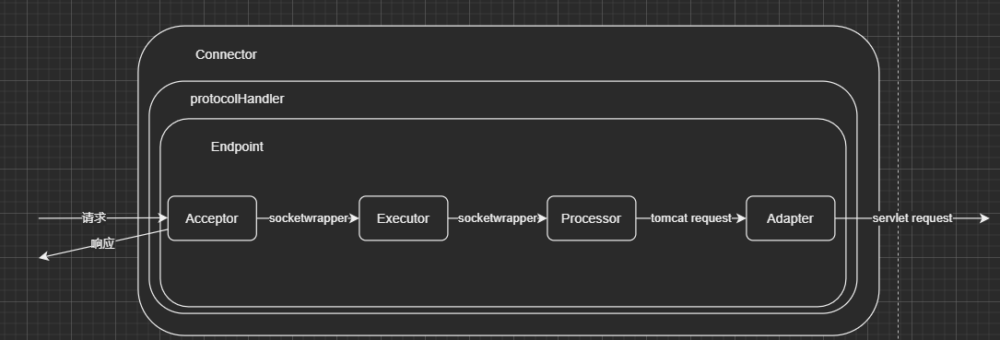

### Tomcat

> Tomcat是Java Servlet, Jsp, Java webSocket的实现

#### 为什么说Tomcat是Servlet容器

因为Tomcat中持有多个Servlet，实现了Servlet规范（request，response，filter）

#### Servlet容器

web项目--->Context标签--->Context.class--->StandardContext--->loadOnStartup()  

Tomcat中的wrapper就是Servlet：

> 加载：ContextConfig.webConfig()—>getContextWebXmlSource()—>Constants.ApplicationWebXml
> 解析：ContextConfig.webConfig()—>configureContext(webXml)—>context.createWrapper()  

#### Tomcat架构图


### Tomcat关键组件继承关系


### Tomcat各组件的含义

* **Server**：In the Tomcat world, a Server represents the whole container.  （在Tomcat的世界中，一个Server表示整个容器）
* **Service**：A Service is an intermediate component which lives inside a Server and ties one or more Connectors to exactly one Engine  （Service是驻留在Server内部，将一个或多个连接器绑定到一个确切的Engine 的中间组件）
* **Connector**：A Connector handles communications with the client. There are multiple connectors available with Tomcat  （连接器用来处理与客户端的交互，Tomcat中有多个可用的连接器，包含Http连接器和AJP连接器）
* **Engine**：An Engine represents request processing pipeline for a specific Service. As a Service may have multiple Connectors, the Engine receives and processes all requests from these connectors, handing the response back to the appropriate connector for transmission to the client  （Engine代表一个特定服务的请求处理管道。一个服务可能有多个连接器，Engine从这些连接器接收并处理所有请求，将响应传递给适当的连接器以传输到客户端）
* **Host** ：A Host is an association of a network name, e.g. www.yourcompany.com, to the Tomcat server. An Engine may contain multiple hosts, and the Host element also supports network aliases such as yourcompany.com and abc.yourcompany.com  （Host是一个相关联的网络名称，一个Engine可以包含多个host，host支持网络别名）
* **Context**  ：A Context represents a web application. A Host may contain multiple contexts, each with a unique path  （context表示一个web应用，一个host可以包含多个唯一路径的context）


#### Connector



> Endpoint接收Socket连接，生成一个SocketProcessor任务提交到线程池处理，SocketProcessor的run方法调用Processor组件解析应用层协议，Processor通过解析生成Tomcat Request后，调用Adapter的service方法。

* Acceptor：提供字节流给Processor
* Processor：提供Tomcat Request给Adapter
* Adapter：提供ServletRequest给容器

##### EndPoint

监听通信端口，是对传输层的抽象，用来实现TCP/IP协议


Endpoint有2个内部类，用来监听Socket请求的Acceptor和用于处理接收到的Socket的SocketProcessor

##### Processor


应用层的抽象，用于实现HTTP协议，接收来自Endpoint的Socket，解析为Tomcat Request和Tomcat Response，并交给Adapter处理

##### Adapter

 CoyoteAdapter，负责将Tomcat Request和Tomcat Response转换为ServletRequest和ServletResponse，调用容器的service方法

##### ProtocolHandler


### 源码解析

#### BootStrap

>  Tomcat的启动类

#### Catalina

> 解析server.xml文件
>
> 创建Server组件，并调用其init和start方法

#### Lifecycle

> 管理各个组件的生命周期（init，start，stop，destroy）

#### Server

> 管理Service组件，并调用其init和start方法

#### Service

> 管理Connector和Engine


### 自定义类加载器

* **WebappClassLoader**：隔离不同的web应用，因为不同的web应用可能同一个类库的不同版本
* **SharedClassLoader**：共享不同web应用的类，继承自CommonClassLoader，一般用来加载web应用共享的资源
* **CatalinaClassLoader**：Tomcat内部的类，需要与web应用的类隔离，父加载器是CommonClassLoader
* **CommonClassLoader**：Tomcat的类和web应用的类可以共享，父加载器是AppClassLoader

**CatalinaClassLoader**, **CommonClassLoader**, **SharedClassLoader**读取配置文件路径：

1. 系统参数中配置的-Dcatalina.config参数

2. conf/catalina.properties

3. /org/apache/catalina/startup/catalina.properties

   配置文件中分别加载server.loader,common.loader, shared.loader配置的资源


### -D配置系统属性

```java
public static void main(String[] args) {
    System.out.println(System.getProperty("configPath"));
}
```


