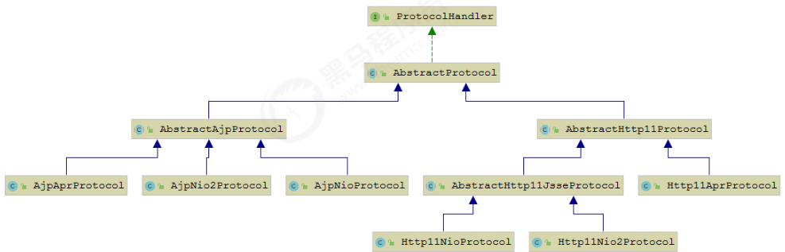
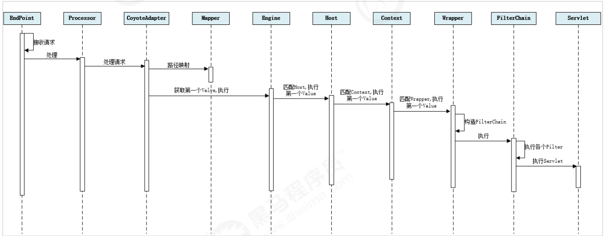

### 1. Tomcat

> Tomcat是Java Servlet, Jsp, Java webSocket的实现

#### 1.1 为什么说Tomcat是Servlet容器

因为Tomcat中持有多个Servlet，实现了Servlet规范（request，response，filter）

#### 1.2 Servlet容器

web项目--->Context标签--->Context.class--->StandardContext--->loadOnStartup()  

Tomcat中的wrapper就是Servlet：

> 加载：ContextConfig.webConfig()—>getContextWebXmlSource()—>Constants.ApplicationWebXml
> 解析：ContextConfig.webConfig()—>configureContext(webXml)—>context.createWrapper()  

#### 1.3 Tomcat架构图


### Tomcat关键组件继承关系


### Tomcat各组件的含义

* **Server**：In the Tomcat world, a Server represents the whole container.  （在Tomcat的世界中，一个Server表示整个容器）
* **Service**：A Service is an intermediate component which lives inside a Server and ties one or more Connectors to exactly one Engine  （Service是驻留在Server内部，将一个或多个连接器绑定到一个确切的Engine 的中间组件）
* **Connector**：A Connector handles communications with the client. There are multiple connectors available with Tomcat  （连接器用来处理与客户端的交互，Tomcat中有多个可用的连接器，包含Http连接器和AJP连接器）
* **Engine**：An Engine represents request processing pipeline for a specific Service. As a Service may have multiple Connectors, the Engine receives and processes all requests from these connectors, handing the response back to the appropriate connector for transmission to the client  （Engine代表一个特定服务的请求处理管道。一个服务可能有多个连接器，Engine从这些连接器接收并处理所有请求，将响应传递给适当的连接器以传输到客户端）
* **Host** ：A Host is an association of a network name, e.g. www.yourcompany.com, to the Tomcat server. An Engine may contain multiple hosts, and the Host element also supports network aliases such as yourcompany.com and abc.yourcompany.com  （Host是一个相关联的网络名称，一个Engine可以包含多个host，host支持网络别名）
* **Context**  ：A Context represents a web application. A Host may contain multiple contexts, each with a unique path  （context表示一个web应用，一个host可以包含多个唯一路径的context）


#### Connector


> Endpoint接收Socket连接，生成一个SocketProcessor任务提交到线程池处理，SocketProcessor的run方法调用Processor组件解析应用层协议，Processor通过解析生成Tomcat Request后，调用Adapter的service方法。

* Acceptor：提供字节流给Processor
* Processor：提供Tomcat Request给Adapter
* Adapter：提供ServletRequest给容器

##### EndPoint

监听通信端口，是对传输层的抽象，用来实现TCP/IP协议


Endpoint有2个内部类，用来监听Socket请求的Acceptor和用于处理接收到的Socket的SocketProcessor

##### Processor


应用层的抽象，用于实现HTTP协议，接收来自Endpoint的Socket，解析为Tomcat Request和Tomcat Response，并交给Adapter处理

##### Adapter

 CoyoteAdapter，负责将Tomcat Request和Tomcat Response转换为ServletRequest和ServletResponse，调用容器的service方法

##### ProtocolHandler


### 源码解析

#### BootStrap

>  Tomcat的启动类

#### Catalina

> 解析server.xml文件
>
> 创建Server组件，并调用其init和start方法

#### Lifecycle

> 管理各个组件的生命周期（init，start，stop，destroy）

#### Server

> 管理Service组件，并调用其init和start方法

#### Service

> 管理Connector和Engine


### 自定义类加载器

* **WebappClassLoader**：隔离不同的web应用，因为不同的web应用可能同一个类库的不同版本
* **SharedClassLoader**：共享不同web应用的类，继承自CommonClassLoader，一般用来加载web应用共享的资源
* **CatalinaClassLoader**：Tomcat内部的类，需要与web应用的类隔离，父加载器是CommonClassLoader
* **CommonClassLoader**：Tomcat的类和web应用的类可以共享，父加载器是AppClassLoader

**CatalinaClassLoader**, **CommonClassLoader**, **SharedClassLoader**读取配置文件路径：

1. 系统参数中配置的-Dcatalina.config参数

2. conf/catalina.properties

3. /org/apache/catalina/startup/catalina.properties

   配置文件中分别加载server.loader,common.loader, shared.loader配置的资源


### -D配置系统属性

```java
public static void main(String[] args) {
    System.out.println(System.getProperty("configPath"));
}
```


8005监听shutdown

 Host - 》Host的危害：假冒网站


### 2. 启动流程

#### 2.1 流程


#### 2.2 源码分析

##### 2.2.1 Lifecycle

基于统一的接口管理所有组件的生命周期，包括Server、Service、Container、Connector、Executor。


##### 2.2.2 各组件默认实现


###### Endpoint

监听通信端口，是对传输层的抽象，用来实现TCP/IP协议


Endpoint有2个内部类，用来监听Socket请求的Acceptor和用于处理接收到的Socket的SocketProcessor

| 实现类       | IO模型 |
| ------------ | ------ |
| NioEndpoint  | NIO    |
| Nio2Endpoint | NIO2   |
| AprEndpoint  | APR    |

**AJP协议**

| 实现类          | IO模型             |
| --------------- | ------------------ |
| AjpNioProtocol  | NIO                |
| AjpNio2Protocol | NIO2               |
| AjpAprProtocol  | APR, 需要依赖APR库 |


**HTTP协议**

| 实现类             | IO模型             |
| ------------------ | ------------------ |
| Http11NioProtocol  | NIO                |
| Http11Nio2Protocol | NIO2               |
| Http11AprProtocol  | APR, 需要依赖APR库 |



#### 2.3 总结

Tomcat的启动过程非常标准，统一安装Lifecycle的定义进行启动，先调用init()方法进行组件的逐级初始化操作，然后再调用start()方法进行启动。

每一级的组件除了完成自身的处理外，还要负责子组件生命周期的管理，组件与组件之间是松耦合的，因为我们可以通过配置文件进行修改和替换。

### 3. Tomcat请求处理流程

#### 3.1 请求流程

设计了这么多层次的容器，Tomcat是如何确定一个请求应该由哪个Wapper容器中的哪个Servlet处理呢？Tomcat是通过Mapper组件完成这个任务的！

Mapper组件的功能是将用户请求的URL定位到一个Servlet，他的原理是：Mapper组件中保存了Web应用的配置信息，其实就是容器组件与访问路径的映射关系，比如：Host容器中配置的域名、Context容器中的Web的应用路径和Wrapper容器中Servlet映射的路径，可以将这些配置看做一个多层次的Map。

当一个请求到来时，Mapper组件通过解析URL中的域名和路径，再到自己保存的Map中去查找，就能定位到一个Servlet，一个请求URL最后只会定位到一个Wrapper容器，也就是一个Servlet。

下图描述了用户请求链接后，是如何找到最终业务处理的Servlet


**请求流程图**



步骤如下：

1. Connector组件中的Endpoint的Acceptor监听客户端Socket连接
2. 将Socket连接提交到Excutor处理，开始执行请求响应任务
3. Processor组件读取消息报文，解析请求行、请求头、请求体，封装为Tomcat的Request对象
4. Mapper组件根据请求行的URL和请求头的Host匹配由哪个Host容器中的哪个Context容器中的Wrapper容器处理请求
5. Adapter组件作为适配器通过service()方法将Tomcat Request、Tomcat Response转换为Servlet Request、Servlet Response并将其作为参数调用Engine容器Pipeline的Valve
6. Engine容器中的Pipeline开始处理，Pipeline中包含若干个Valve（阀），每个Valve负责部分逻辑的处理。执行完后调用基础的Valve，即StandardEngineValve，负责调用Host容器的Pipeline
7. Host容器的管道开始处理，流程类似，最后调用Context容器的Pipeline
8. Context容器的管道开始处理，流程类似，最后调用Wrapper容器的Pipeline
9. Wrapper容器的管道开始处理，流程类似，然后构建FilterChain，执行FilterChain中的doFilter方法，执行完成后，最终调用Servlet的service()方法

#### 3.2 请求源码解析


从Tomcat的整体架构中，可以发现Tomcat中的各个组件各司其职，各组件之间松耦合，确保整体架构的可伸缩性和可扩展性。在Tomcat中，每个Container组件采用责任链模式来完成具体的请求处理。

Tomcat中定义了Pipeline和Valve两个接口，每个Container组件中都有一个Pipeline，Pipeline用于构建责任链，Valve代表责任链上的每个处理器。Pipeline维护了一个基础的Valve，他始终位于Pipeline的末端（最后执行），封装了具体的请求处理和输出响应过程。我们也可以调用addValve()方法为Pipeline添加其他的Valve，后添加的Valve位于基础的Valve之前，并按照添加顺序执行。Pipeline通过获得首个Valve来启动整个责任链的执行。

### 4. Jasper

#### 4.1 简介

对于基于JSP的web应用来说，我们可以直接在Jsp页面上编写Java代码，添加第三方的标签库，使用EL表达式。但是无论经过怎样形式的处理，最终输出到客户端的都是标准的HTML页面，并不包含Java的语法。我们可以把jsp看做是一种运行在服务端的脚本，那么服务器是如何把jsp页面转换为HTML页面呢？

Jasper模块是Tomcat的JSP核心引擎，我们知道JSP的本质上是一个Servlet。Tomcat使用Jasper对JSP语法进行解析，生成Servlet并生成Class字节码，用户访问jsp时，会访问Servlet，最终将访问结果直接响应给浏览器。另外，在运行时，Jasper通过监听器机制检测jsp文件是否修改，如果修改，则会重新编译jsp文件。

#### 4.2 编译方式

##### 4.2.1 运行时编译

Tomcat不会在启动Web应用时自动编译jsp文件，而是在客户端第一次请求时，才编译需要访问的jsp文件。

**创建一个项目，并编写jsp代码**：

```jsp
<%@ page import="java.text.DateFormat" %>
<%@ page import="java.text.SimpleDateFormat" %>
<%@ page import="java.util.Date" %>

<%@ page contentType="text/html;charset=UTF-8" language="java" %>
<%@ taglib prefix="c" uri="http://java.sun.com/jsp/jstl/core" %>
<html>
  <head>
        <title>$Title$</title>
      </head>
  <body>
    <% DateFormat dateFormat = new SimpleDateFormat("yyyy‐MM‐dd HH:mm:ss");
        String format = dateFormat.format(new Date());%>
    Hello , Java Server Page 。。。。
    <br/>
    <%= format %>
  </body>
</html>
```


##### 4.2.2 编译过程

在Tomcat默认的全局web.xm中配置了一个org.apache.jasper.servlet.JspServlet，用于处理所有的.jsp, .jspx结尾的请求，该Servlet实现便是运行时编译入口。

```xml
	<servlet>
        <servlet-name>jsp</servlet-name>
        <servlet-class>org.apache.jasper.servlet.JspServlet</servlet-class>
        <init-param>
            <param-name>fork</param-name>
            <param-value>false</param-value>
        </init-param>
        <init-param>
            <param-name>xpoweredBy</param-name>
            <param-value>false</param-value>
        </init-param>
        <load-on-startup>3</load-on-startup>
    </servlet>
	<servlet-mapping>
        <servlet-name>jsp</servlet-name>
        <url-pattern>*.jsp</url-pattern>
        <url-pattern>*.jspx</url-pattern>
    </servlet-mapping>
```

**JspServlet处理流程图**


##### 4.2.3 编译结果

1. 如果conf/web.xml中配置了scratchdir参数，则jsp编译后的结果会存储在该目录下
2. 如果没有配置上面的参数，编译结果会保存在Tomcat安装目录下的work/Catalina/host/context下
3. IDEA集成Tomcat时，编译结果保存在C:\Users\Administrator\.IntelliJIdea2019.1\system\tomcat\_project_tomcat\work\Catalina\localhost\jsp_demo_01_war_exploded\org\apache\jsp


##### 4.2.4 预编译

除了运行时编译，我们还可以直接在Web应用启动时， 一次性将Web应用中的所有的JSP页面一次性编译完成。在这种情况下，Web应用运行过程中，便可以不必再进行实时编译，而是直接调用JSP页面对应的Servlet 完成请求处理， 从而提升系统性能。

Tomcat 提供了一个Shell程序JspC，用于支持JSP预编译，而且在Tomcat的安装目录下提供了一个 catalina-tasks.xml 文件声明了Tomcat 支持的Ant任务， 因此，我们很容易使用 Ant 来执行JSP 预编译 。（要想使用这种方式，必须得确保在此之前已经下载并安装了Apache Ant）。


#### 4.3 Jsp编译原理

##### 4.3.1 代码分析

jsp文件生成的.java文件：

```java
/*
 * Generated by the Jasper component of Apache Tomcat
 * Version: Apache Tomcat/@VERSION@
 * Generated at: 2020-08-08 08:06:37 UTC
 * Note: The last modified time of this file was set to
 *       the last modified time of the source file after
 *       generation to assist with modification tracking.
 */
package org.apache.jsp;

import javax.servlet.*;
import javax.servlet.http.*;
import javax.servlet.jsp.*;
import java.text.DateFormat;
import java.text.SimpleDateFormat;
import java.util.Date;

public final class index_jsp extends org.apache.jasper.runtime.HttpJspBase
    implements org.apache.jasper.runtime.JspSourceDependent,
                 org.apache.jasper.runtime.JspSourceImports {

  private static final javax.servlet.jsp.JspFactory _jspxFactory =
          javax.servlet.jsp.JspFactory.getDefaultFactory();

  private static java.util.Map<java.lang.String,java.lang.Long> _jspx_dependants;

  static {
    _jspx_dependants = new java.util.HashMap<java.lang.String,java.lang.Long>(2);
    _jspx_dependants.put("jar:file:/C:/Users/wuyiming/Desktop/source/apache-tomcat-8.5.57-src/apache-tomcat-8.5.57/webapps/servlet_demo01/WEB-INF/lib/standard.jar!/META-INF/c.tld", Long.valueOf(1098682290000L));
    _jspx_dependants.put("/WEB-INF/lib/standard.jar", Long.valueOf(1596727176518L));
  }

  private static final java.util.Set<java.lang.String> _jspx_imports_packages;

  private static final java.util.Set<java.lang.String> _jspx_imports_classes;

  static {
    _jspx_imports_packages = new java.util.HashSet<>();
    _jspx_imports_packages.add("javax.servlet");
    _jspx_imports_packages.add("javax.servlet.http");
    _jspx_imports_packages.add("javax.servlet.jsp");
    _jspx_imports_classes = new java.util.HashSet<>();
    _jspx_imports_classes.add("java.util.Date");
    _jspx_imports_classes.add("java.text.SimpleDateFormat");
    _jspx_imports_classes.add("java.text.DateFormat");
  }

  private volatile javax.el.ExpressionFactory _el_expressionfactory;
  private volatile org.apache.tomcat.InstanceManager _jsp_instancemanager;

  public java.util.Map<java.lang.String,java.lang.Long> getDependants() {
    return _jspx_dependants;
  }

  public java.util.Set<java.lang.String> getPackageImports() {
    return _jspx_imports_packages;
  }

  public java.util.Set<java.lang.String> getClassImports() {
    return _jspx_imports_classes;
  }

  public javax.el.ExpressionFactory _jsp_getExpressionFactory() {
    if (_el_expressionfactory == null) {
      synchronized (this) {
        if (_el_expressionfactory == null) {
          _el_expressionfactory = _jspxFactory.getJspApplicationContext(getServletConfig().getServletContext()).getExpressionFactory();
        }
      }
    }
    return _el_expressionfactory;
  }

  public org.apache.tomcat.InstanceManager _jsp_getInstanceManager() {
    if (_jsp_instancemanager == null) {
      synchronized (this) {
        if (_jsp_instancemanager == null) {
          _jsp_instancemanager = org.apache.jasper.runtime.InstanceManagerFactory.getInstanceManager(getServletConfig());
        }
      }
    }
    return _jsp_instancemanager;
  }

  public void _jspInit() {
  }

  public void _jspDestroy() {
  }

  public void _jspService(final javax.servlet.http.HttpServletRequest request, final javax.servlet.http.HttpServletResponse response)
      throws java.io.IOException, javax.servlet.ServletException {

    final java.lang.String _jspx_method = request.getMethod();
    if (!"GET".equals(_jspx_method) && !"POST".equals(_jspx_method) && !"HEAD".equals(_jspx_method) && !javax.servlet.DispatcherType.ERROR.equals(request.getDispatcherType())) {
      response.sendError(HttpServletResponse.SC_METHOD_NOT_ALLOWED, "JSP 只允许 GET、POST 或 HEAD。Jasper 还允许 OPTIONS");
      return;
    }

    final javax.servlet.jsp.PageContext pageContext;
    javax.servlet.http.HttpSession session = null;
    final javax.servlet.ServletContext application;
    final javax.servlet.ServletConfig config;
    javax.servlet.jsp.JspWriter out = null;
    final java.lang.Object page = this;
    javax.servlet.jsp.JspWriter _jspx_out = null;
    javax.servlet.jsp.PageContext _jspx_page_context = null;


    try {
      response.setContentType("text/html;charset=UTF-8");
      pageContext = _jspxFactory.getPageContext(this, request, response,
      			null, true, 8192, true);
      _jspx_page_context = pageContext;
      application = pageContext.getServletContext();
      config = pageContext.getServletConfig();
      session = pageContext.getSession();
      out = pageContext.getOut();
      _jspx_out = out;

      out.write("\r\n");
      out.write("\r\n");
      out.write("\r\n");
      out.write("\r\n");
      out.write("\r\n");
      out.write("\r\n");
      out.write("<html>\r\n");
      out.write("  <head>\r\n");
      out.write("        <title>$Title$</title>\r\n");
      out.write("      </head>\r\n");
      out.write("  <body>\r\n");
      out.write("    ");
 DateFormat dateFormat = new SimpleDateFormat("yyyy‐MM‐dd HH:mm:ss");
        String format = dateFormat.format(new Date());
      out.write("\r\n");
      out.write("    Hello , Java Server Page 。。。。\r\n");
      out.write("    <br/>\r\n");
      out.write("    ");
      out.print( format );
      out.write("\r\n");
      out.write("  </body>\r\n");
      out.write("</html>");
    } catch (java.lang.Throwable t) {
      if (!(t instanceof javax.servlet.jsp.SkipPageException)){
        out = _jspx_out;
        if (out != null && out.getBufferSize() != 0)
          try {
            if (response.isCommitted()) {
              out.flush();
            } else {
              out.clearBuffer();
            }
          } catch (java.io.IOException e) {}
        if (_jspx_page_context != null) _jspx_page_context.handlePageException(t);
        else throw new ServletException(t);
      }
    } finally {
      _jspxFactory.releasePageContext(_jspx_page_context);
    }
  }
}

```

源码分析：

1. 类名为index_jsp，对应index.jsp文件，继承自org.apache.jasper.runtime.HttpJspBase，这个类时HttpSevlet的子类，所以jsp本质上就是一个Servlet

2. 通过属性_jspx_dependants保存了当前JSP页面依赖的资源，包含引入的外部的JSP页面、导入的标签、标签所在的jar包等，便于后续处理过程中使用（如重新编译检测，因此它以Map形式保存了每个资源的上次修改时间）

3. 通过属性 _jspx_imports_packages 存放导入的 java 包， 默认导入 javax.servlet ，javax.servlet.http, javax.servlet.jsp

4. 通过属性 _jspx_imports_classes 存放导入的类， 通过import 指令导入的DateFormat 、SimpleDateFormat 、Date 都会包含在该集合中。_jspx_imports_packages 和 _jspx_imports_classes 属性主要用于配置 EL 引擎上下文

5. 请求处理由方法 _jspService 完成 ， 而在父类 HttpJspBase 中的service 方法通过模板方法模式 ， 调用了子类的 _jspService 方法

   ```java
   @Override
   public final void service(HttpServletRequest request, HttpServletResponse response)
       throws ServletException, IOException
   {
       _jspService(request, response);
   }
   ```

6.  _jspService 方法中定义了几个重要的局部变量 ： pageContext 、Session、application、config、out、page。由于整个页面的输出有 _jspService 方法完成，因此这些变量和参数会对整个JSP页面生效。 这也是我们为什么可以在JSP页面使用这些变量的原因。

7. 指定文档类型的指令 （page） 最终转换为 response.setContentType() 方法调用

8. 对于每一行的静态内容（HTML） ， 调用 out.write 输出

9.  对于 <% ... %> 中的java 代码 ， 将直接转换为 Servlet 类中的代码。 如果在 Java代码中嵌入了静态文件， 则同样调用 out.write 输出


##### 4.3.2 编译流程


Compiler  编译工作主要包含代码生成 和 编译两部分:

**代码生成**

1. Compiler 通过一个 PageInfo 对象保存JSP 页面编译过程中的各种配置，这些配置可能来源于 Web 应用初始化参数， 也可能来源于JSP页面的指令配置（如 page ，include）。
2. 调用ParserController 解析指令节点， 验证其是否合法，同时将配置信息保存到PageInfo 中， 用于控制代码生成
3. 调用ParserController 解析整个页面， 由于 JSP 是逐行解析， 所以对于每一行会创建一个具体的Node 对象。如 静态文本（TemplateText）、Java代码（Scriptlet）、定制标签（CustomTag）、Include指令（IncludeDirective）。
4. 验证除指令外其他所有节点的合法性， 如 脚本、定制标签、EL表达式等
5.  收集除指令外其他节点的页面配置信息
6. 编译并加载当前 JSP 页面依赖的标签
7. 对于JSP页面的EL表达式，生成对应的映射函数
8. 生成JSP页面对应的Servlet 类源代码

**编译**

代码生成完成后， Compiler 还会生成 SMAP 信息。 如果配置生成 SMAP 信息，Compiler 则会在编译阶段将SMAP 信息写到class 文件中 。

在编译阶段， Compiler 的两个实现 AntCompiler 和 JDTCompiler 分别调用先关框架的API 进行源代码编译。

对于 AntCompiler 来说， 构造一个 Ant 的javac 的任务完成编译。

对于 JDTCompiler 来说， 调用 org.eclipse.jdt.internal.compiler.Compiler 完成编译

### 5. Tomcat服务器配置

#### 5.1 server.xml

##### Server

```xml
<Server port="8005" shutdown="SHUTDOWN">
	...
</Server>
```

* **port：**Tomcat监听的关闭服务器的端口
* **shutdown：**关闭服务器的指令字符串，可以改成其他的

Server内嵌的子元素为Listener、GlobalNamingResources、Service。

默认配置的5个Listener的含义：

```xml
<!‐‐ 用于以日志形式输出服务器 、操作系统、JVM的版本信息 ‐‐>
<Listener className="org.apache.catalina.startup.VersionLoggerListener"/>
<!‐‐ 用于加载（服务器启动） 和 销毁 （服务器停止） APR。 如果找不到APR库， 则会
输出日志， 并不影响Tomcat启动 ‐‐>
<Listener className="org.apache.catalina.core.AprLifecycleListener" SSLEngine="on" />
<!‐‐ 用于避免JRE内存泄漏问题 ‐‐>
<Listener className="org.apache.catalina.core.JreMemoryLeakPreventionListener" />
<!‐‐ 用户加载（服务器启动） 和 销毁（服务器停止） 全局命名服务 ‐‐>
<Listener className="org.apache.catalina.mbeans.GlobalResourcesLifecycleListener"/>
<!‐‐ 用于在Context停止时重建Executor 池中的线程， 以避免ThreadLocal 相关的内存泄漏 ‐‐>
<Listener className="org.apache.catalina.core.ThreadLocalLeakPreventionListener" />
```

GlobalNamingResources 中定义了全局命名服务:

```xml
<!‐‐ Global JNDI resources
     Documentation at /docs/jndi‐resources‐howto.html
‐‐>
<GlobalNamingResources>
    <!‐‐ Editable user database that can also be used by
         UserDatabaseRealm to authenticate users
    ‐‐>
    <Resource name="UserDatabase" auth="Container"
              type="org.apache.catalina.UserDatabase"
              description="User database that can be updated and saved"
             
factory="org.apache.catalina.users.MemoryUserDatabaseFactory"
              pathname="conf/tomcat‐users.xml" />
</GlobalNamingResources>
```


##### Service

用于创建Service实例，默认为StandardService。默认情况下，Tomcat仅指定了Service的名称（Catalina）。Service可以内嵌的元素为：Listener、Executor、Connector和Engine，其中，Listener用于为Service添加生命周期监听，Executor用于配置Service共享线程池，Connector用于配置Service包含的连接器，Engine用于配置Service中的连接器对应的Servlet容器引擎。

```xml
<Service name="Catalina">
    ...
</Service>
```

一个Server可以包含多个Service。

##### Executor

默认情况下，Service 并未添加共享线程池配置。 如果我们想添加一个线程池， 可以添加如下配置：

```xml
<Executor name="tomcatThreadPool"
    namePrefix="catalina‐exec‐"
    maxThreads="200"
    minSpareThreads="100"
    maxIdleTime="60000"
    maxQueueSize="100"
    prestartminSpareThreads="false"
    threadPriority="5"
    className="org.apache.catalina.core.StandardThreadExecutor"/>
```

| 属性                    | 含义                                                         |
| ----------------------- | ------------------------------------------------------------ |
| name                    | 线程池名字，用于在Connector中引用                            |
| namePrefix              | 线程名前缀                                                   |
| maxThreads              | 最大线程数                                                   |
| maxIdleTime             | 最大空闲时间，超过此时间后，空闲时间会被销毁，默认6000       |
| maxQueueSize            | 队列最大长度，默认INT的最大值                                |
| prestartminSpareThreads | 启动线程时是否启动minSpareThreads部分线程，默认false，不启动 |
| threadPriority          | 线程优先级，默认为5，值从1到10                               |
| className               | 线程池实现类，默认为StandardThreadExecutor，如果自定义，需要实现org.apache.catalina.Executor接口 |
| minSpareThreads         | 活跃线程数，也就是核心线程数                                 |

配置了之后可以通过jconsole等工具查看线程池的配置情况。

如果不配置共享线程池，那么各组件在用到线程池时独立创建。

##### Connector

用于创建连接器实例，在Tomcat8.5.57中，默认只配置了一个支持HTTP的NIO连接器

```xml
<Connector port="8080" protocol="HTTP/1.1"
               connectionTimeout="20000"
               redirectPort="8443" />
```

在之前版本中，还配置了一个支持AJP协议的连接器

```xml
<Connector port="8009" protocol="AJP/1.3" redirectPort="8443" />
```

属性说明：

1. **port：**端口号，Connector 用于创建服务端Socket 并进行监听， 以等待客户端请求连接。如果该属性设置为0，Tomcat将会随机选择一个可用的端口号给当前Connector使用
2. **protocol：**当前Connector 支持的访问协议。 默认为 HTTP/1.1 ， 并采用自动切换机制选择一个基于 JAVA NIO 的链接器或者基于本地APR的链接器（根据本地是否含有Tomcat的本地库判定）

如果不希望采用上述自动切换的机制， 而是明确指定协议， 可以使用以下值

**HTTP协议：**

```java
org.apache.coyote.http11.Http11NioProtocol  //非阻塞式 Java NIO 连接器
org.apache.coyote.http11.Http11Nio2Protocol // 非阻塞式 JAVA NIO2 连接器 
org.apache.coyote.http11.Http11AprProtocol  // APR 连接器
```

**AJP协议：**

```java
org.apache.coyote.ajp.AjpNioProtocol  //非阻塞式 Java NIO 连接器
org.apache.coyote.ajp.AjpNio2Protocol //非阻塞式 JAVA NIO2 连接器 
org.apache.coyote.ajp.AjpAprProtocol  //APR 连接器
```

3. **connectionTimeOut:**Connector 接收链接后的等待超时时间， 单位为 毫秒。 -1 表示不超时
4. **redirectPort:**当前Connector 不支持SSL请求， 接收到了一个请求， 并且也符合security-constraint 约束， 需要SSL传输，Catalina自动将请求重定向到指定的端口
5. **executor:**指定共享线程池的名称， 也可以通过maxThreads、minSpareThreads等属性配置内部线程池
6. **URIEncoding：**用于指定编码URI的字符编码， Tomcat8.x版本默认的编码为 UTF-8 ,Tomcat7.x版本默认为ISO-8859-1

完整配置如下：

```xml
<Connector port="8080"  
          protocol="HTTP/1.1"
          executor="tomcatThreadPool"
          maxThreads="1000"  
          minSpareThreads="100"  
          acceptCount="1000" 
          maxConnections="1000" 
          connectionTimeout="20000"
          compression="on" 
          compressionMinSize="2048" 
          disableUploadTimeout="true" 
          redirectPort="8443" 
          URIEncoding="UTF‐8" /> 
```


##### Engine

Engine  作为Servlet 引擎的顶级元素，内部可以嵌入： Cluster、Listener、Realm、Valve和Host。

```xml
<Engine name="Catalina" defaultHost="localhost">
...    
</Engine>
```

属性说明：

1.  **name：** 用于指定Engine 的名称， 默认为Catalina 。该名称会影响一部分Tomcat的存储路径（如临时文件）。
2. **defaultHost ：** 默认使用的虚拟主机名称， 当客户端请求指向的主机无效时， 将交由默认的虚拟主机处理， 默认为localhost。

##### Host

Host 元素用于配置一个虚拟主机， 它支持以下嵌入元素：Alias、Cluster、Listener、Valve、Realm、Context。如果在Engine下配置Realm， 那么此配置将在当前Engine下的所有Host中共享。 同样，如果在Host中配置Realm ， 则在当前Host下的所有Context中共享。Context中的Realm优先级 > Host 的Realm优先级 > Engine中的Realm优先级

```xml
<Host name="localhost"  appBase="webapps" unpackWARs="true" autoDeploy="true">
    ...
</Host>
```

属性说明:

1. **name:** 当前Host通用的网络名称， 必须与DNS服务器上的注册信息一致。 Engine中包含的Host必须存在一个名称与Engine的defaultHost设置一致
2. **appBase:**当前Host的应用基础目录， 当前Host上部署的Web应用均在该目录下（可以是绝对目录，相对路径）。默认为webapps
3. **unpackWARs:**设置为true， Host在启动时会将appBase目录下war包解压为目录。设置为false， Host将直接从war文件启动
4. **autoDeploy：**控制tomcat是否在运行时定期检测并自动部署新增或变更的web应用

通过给 Host添加别名，我们可以实现同一个Host拥有多个网络名称，配置如下：

```xml
<Host name="www.web1.com"  appBase="webapps" unpackWARs="true"
autoDeploy="true">
    <Alias>www.web2.com</Alias>
</Host> 
```

这个时候，我们就可以通过两个域名访问当前Host下的应用（需要确保DNS或hosts中添加了域名的映射配置）


##### Context

Context 用于配置一个Web应用，默认的配置如下

```xml
<Context docBase="myApp" path="/myApp">
    ....
</Context>
```

属性描述：

1. **docBase:**Web应用目录或者War包的部署路径。可以是绝对路径，也可以是相对于Host appBase的相对路径
2. **path:**Web应用的Context 路径。如果我们Host名为localhost， 则该web应用访问的根路径为： http://localhost:8080/myApp

Context支持的内嵌元素为：CookieProcessor， Loader， Manager，Realm，Resources，
WatchedResource，JarScanner，Valve

```xml
<Host name="www.wangyali.com"  appBase="wyl_webapps" startStopThreads="4"
            unpackWARs="true" autoDeploy="true">
			 </Host>
			 
	  <Host name="www.wuyiming.com"  appBase="wym_webapps" startStopThreads="4"
            unpackWARs="true" autoDeploy="true">
			
		<Context docBase="ROOT" path="/myTomcat">
		</Context>
        <Valve className="org.apache.catalina.valves.AccessLogValve" directory="logs"
               prefix="localhost_access_log" suffix=".txt"
               pattern="%h %l %u %t &quot;%r&quot; %s %b" />
```

#### 4.2 tomcat-users.xml

该配置文件中，主要配置的是Tomcat的用户，角色等信息，用来控制Tomcat中manager， host-manager的访问权限

### 6. Web应用配置

web.xml 是web应用的描述文件， 它支持的元素及属性来自于Servlet 规范定义 。 在Tomcat 中， Web 应用的描述信息包括 tomcat/conf/web.xml 中默认配置 以及 Web应用 WEB-INF/web.xml 下的定制配置

#### 6.1 ServletContext初始化参数

我们可以通过 添加ServletContext 初始化参数，它配置了一个键值对，这样我们可以在应用程序中使用 javax.servlet.ServletContext.getInitParameter()方法获取参数

```xml
<context‐param>
    <param‐name>contextConfigLocation</param‐name>
    <param‐value>classpath:applicationContext‐*.xml</param‐value>
    <description>Spring Config File Location</description>
</context‐param>
```

#### 6.2 会话配置

用于配置Web应用回话，包括超时时间、Cookie配置及会话追踪模式。他将覆盖server.xml和context.xml中的配置

```xml
<session‐config>
    <session‐timeout>30</session‐timeout>
    <cookie‐config>
      <name>JESSIONID</name>
      <domain>www.itcast.cn</domain>
      <path>/</path>
      <comment>Session Cookie</comment>
      <http‐only>true</http‐only>
      <secure>false</secure>
      <max‐age>3600</max‐age>
    </cookie‐config>
    <tracking‐mode>COOKIE</tracking‐mode>
  </session‐config>
```

配置解析：

1. **session‐timeout：**会话超时时间，单位为min
2. **cookie-config：**用于配置会话追踪Cookie
   * name：Cookie的名称
   * domain：Cookie的域名
   * path：Cookie的路径
   * comment：注释
   * http‐only：cookie只能通过HTTP方式进行访问，JS无法读取或修改，此项可以增加网站访问的安全性。
   * secure：此cookie只能通过HTTPS连接传递到服务器，而HTTP 连接则不会传递该信息。注意是从浏览器传递到服务器，服务器端的Cookie对象不受此项影响
   * max‐age：以秒为单位表示cookie的生存期，默认为‐1表示是会话Cookie，浏览器关闭时就会消失
3. tracking‐mode ：用于配置会话追踪模式，Servlet3.0版本中支持的追踪模式：
   COOKIE、URL、SSL
   * COOKIE : 通过HTTP Cookie 追踪会话是最常用的会话追踪机制， 而且Servlet规范也要求所有的Servlet规范都需要支持Cookie追踪。
   * URL : URL重写是最基本的会话追踪机制。当客户端不支持Cookie时，可以采用URL重写的方式。当采用URL追踪模式时，请求路径需要包含会话标识信息，Servlet容器会根据路径中的会话标识设置请求的会话信息。如：http：//www.myserver.com/user/index.html;jessionid=1234567890
   *  SSL : 对于SSL请求， 通过SSL会话标识确定请求会话标识。


#### 6.3 Servlet配置

```xml
<servlet>
  <servlet‐name>myServlet</servlet‐name>
  <servlet‐class>cn.wym.web.MyServlet</servlet‐class>
  <init‐param>
    <param‐name>fileName</param‐name>
    <param‐value>init.conf</param‐value>
  </init‐param>
  <load‐on‐startup>1</load‐on‐startup>
  <enabled>true</enabled>
</servlet>
<servlet‐mapping>
  <servlet‐name>myServlet</servlet‐name>
  <url‐pattern>*.do</url‐pattern>
  <url‐pattern>/myservet/*</url‐pattern>
</servlet‐mapping>
```

属性解析：

1. init‐param： 用于指定servlet的初始化参数， 在应用中可以通过HttpServlet.getInitParameter 获取。 
2. load‐on‐startup： 用于控制在Web应用启动时，Servlet的加载顺序。 值小于0，web应用启动时，不加载该servlet, 第一次访问时加载。
3. enabled： true ， false 。 若为false ，表示Servlet不处理任何请求。
4. url‐pattern： 用于指定URL表达式，一个 servlet‐mapping可以同时配置多个 url‐pattern。

Servlet 中文件上传配置：

```xml
<servlet>
<servlet‐name>uploadServlet</servlet‐name>    
<servlet‐class>cn.wym.web.UploadServlet</servlet‐class>    
<multipart‐config>    
  <location>C://path</location>    
  <max‐file‐size>10485760</max‐file‐size>    
  <max‐request‐size>10485760</max‐request‐size>    
  <file‐size‐threshold>0</file‐size‐threshold>    
</multipart‐config>    
</servlet>
```

属性解析：

1. location：存放生成的文件地址。
2. max‐file‐size：允许上传的文件最大值。 默认值为‐1， 表示没有限制。
3. max‐request‐size：针对该 multi/form‐data 请求的最大数量，默认值为‐1， 表示
   无限制。
4. file‐size‐threshold：当数量量大于该值时， 内容会被写入文件。


####  6.4 Listener配置

Listener用于监听servlet中的事件，例如context、request、session对象的创建、修改、删除，并触发响应事件。Listener是观察者模式的实现，在servlet中主要用于对context、request、session对象的生命周期进行监控。在servlet2.5规范中共定义了8中Listener。在启动时，ServletContextListener 的执行顺序与web.xml 中的配置顺序一致， 停止时执行顺序相反。

```xml
<listener>
<listener‐class>org.springframework.web.context.ContextLoaderListener</listener‐class>
   
</listener>
```


#### 6.5 Filter配置

filter  用于配置web应用过滤器， 用来过滤资源请求及响应。 经常用于认证、日志、加密、数据转换等操作， 配置如下:

```xml
<filter>
    <filter‐name>myFilter</filter‐name>    
    <filter‐class>cn.wym.web.MyFilter</filter‐class>    
    <async‐supported>true</async‐supported>    
    <init‐param>    
      <param‐name>language</param‐name>    
      <param‐value>CN</param‐value>    
    </init‐param>    
</filter>
<filter‐mapping>
    <filter‐name>myFilter</filter‐name>    
    <url‐pattern>/*</url‐pattern>    
</filter‐mapping>
```

配置说明：

1. filter‐name： 用于指定过滤器名称，在web.xml中，过滤器名称必须唯一。
2. filter‐class ： 过滤器的全限定类名， 该类必须实现Filter接口。
3. async‐supported： 该过滤器是否支持异步
4. init‐param ：用于配置Filter的初始化参数， 可以配置多个， 可以通过FilterConfig.getInitParameter获取
5. url‐pattern： 指定该过滤器需要拦截的URL

#### 6.6 欢迎页面配置

```xml
<welcome‐file‐list>
    <welcome‐file>index.html</welcome‐file>
    <welcome‐file>index.htm</welcome‐file>
    <welcome‐file>index.jsp</welcome‐file>
</welcome‐file‐list>
```


#### 6.7 错误页面配置

error-page 用于配置Web应用访问异常时定向到的页面，支持HTTP响应码和异常类两种
形式。

```xml
<error‐page>
    <error‐code>404</error‐code>
    <location>/404.html</location>
</error‐page>
<error‐page>
    <error‐code>500</error‐code>
    <location>/500.html</location>
</error‐page>
<error‐page>
    <exception‐type>java.lang.Exception</exception‐type>
    <location>/error.jsp</location>
</error‐page>
```


### 7. Tomcat管理配置

#### 7.1 host-manager

Tomcat启动之后，可以通过 http://localhost:8080/host-manager/html  访问该Web应用。 host-manager 默认添加了访问权限控制，当打开网址时，需要输入用户名和密码（conf/tomcat-users.xml中配置） 。所以要想访问该页面，需要在conf/tomcat-users.xml 中配置，并分配对应的角色

1. admin-gui：用于控制页面访问权限
2. admin-script：用于控制以简单文本的形式进行访问

配置如下：

```xml
<role rolename="admin‐gui"/>
<role rolename="admin‐script"/>
<user username="root" password="root" roles="admin‐script,admin‐gui"/>
```

#### 7.2 manager

manager 的访问地址为 http://localhost:8080/manager， 同样， manager也添加了页
面访问控制，因此我们需要为登录用户分配角色为

```xml
<role rolename="manager‐gui"/>
<role rolename="manager‐script"/>
<user username="root" password="root" roles="admin‐script,admin‐gui,manager‐gui,manager‐script"/>
```


#### 7.3 Server Status


### 8. JVM配置


catalina.sh

> JAVA_OPTS="‐server ‐Xms1024m ‐Xmx2048m ‐XX:MetaspaceSize=256m ‐XX:MaxMetaspaceSize=512m  ‐XX:SurvivorRatio=8"


### 9. Tomcat集群

#### 9.1 简介

由于单台Tomcat的承载能力是有限的，当我们的业务系统用户量比较大，请求压力比较
大时，单台Tomcat是扛不住的，这个时候，就需要搭建Tomcat的集群，而目前比较流
程的做法就是通过Nginx来实现Tomcat集群的负载均衡


#### 9.2 环境准备

在服务器上, 安装两台tomcat, 然后分别改Tomcat服务器的端口号 :

```java
8005 ‐‐‐‐‐‐‐‐‐> 8015 ‐‐‐‐‐‐‐‐‐> 8025 
8080 ‐‐‐‐‐‐‐‐‐> 8888 ‐‐‐‐‐‐‐‐‐> 9999 
8009 ‐‐‐‐‐‐‐‐‐> 8019 ‐‐‐‐‐‐‐‐‐> 8029
```


#### 安装Nginx

在当前服务器上 , 安装Nginx , 然后再配置Nginx, 配置nginx.conf :

```
upstream serverpool{ 
    server localhost:8888;
    server localhost:9999;
}
server {
    listen       99;
    server_name localhost;
    
    location / {    
      proxy_pass http://serverpool/;      
    }
}
```


#### 负载均衡策略

1. **轮询**

最基本的配置方法，它是upstream模块默认的负载均衡默认策略。每个请求会按时间顺序逐一分配到不同的后端服务器

```
upstream serverpool{ 
    server localhost:8888;
    server localhost:9999;
}
```

参数说明：

| 参数         | 描述                                                         |
| ------------ | ------------------------------------------------------------ |
| fail_timeout | 与max_fails结合使用                                          |
| max_fails    | 设置在fail_timeout参数设置的时间内最大失败次数，如果在这个时<br/>间内，所有针对该服务器的请求都失败了，那么认为该服务器会被<br/>认为是停机了 |
| fail_time    | 服务器被认为停机的时间长度，默认为10s                        |
| backup       | 标记该服务器为备份服务器。当主服务器停止时，请求会被发送到这台服务器 |
| down         | 标记服务器永久停机了                                         |

2. **weight权重**

   ```
   upstream serverpool{ 
       server localhost:8888 weight=3;
       server localhost:9999 weight=1;
   }
   ```

   weight参数用于指定轮询几率，weight的默认值为1；weight的数值与访问比率成正比，比如8888服务器上的服务被访问的几率为9999服务器的三倍。此策略比较适合服务器的硬件配置差别比较大的情况

3. **ip_hash**

   指定负载均衡器按照基于客户端IP的分配方式，这个方法确保了相同的客户端的请求一直发送到相同的服务器，以保证session会话。这样每个访客都固定访问一个后端服务器，可以解决session不能跨服务器的问题

   ```
   upstream serverpool{ 
       ip_hash;
       server 192.168.192.133:8080;
       server 192.168.192.137:8080;
   }
   ```

   


#### 9.3 Session共享方案

在Tomcat集群中，如果应用需要用户进行登录，那么这个时候，用于tomcat做了负载均衡，则用户登录并访问应用系统时，就会出现问题。


#####  ip_hash 策略


##### Session复制

在servlet_demo01 工程中 , 制作session.jsp页面，分别将工程存放在两台 tomcat 的
webapps/ 目录下

```jsp
<%@ page contentType="text/html;charset=UTF‐8" language="java" %>
<html>
<head>
    <title>Title</title>
</head>
<body>
   
    TOMCAT ‐ 9999 ：
   
<br/>    
sessionID : <%= session.getId()%>    
   
<br/>    
   
    <%
        Object loginUser = session.getAttribute("loginUser");
        if(loginUser != null && loginUser.toString().length()>0){
            out.println("session 有值, loginUser = " + loginUser);
        }else{
            session.setAttribute("loginUser","ITCAST");
            out.println("session 没有值");
        }
    %>
</body>
</html>
```

通过nginx访问 ， http://localhost:99/demo01/session.jsp  ，访问到的两台Tomcat出
现的sessionID是不一样的：


上述现象，则说明两台 Tomcat的Session各是各的，并没有进行同步，这在集群环境下是存在问题的。

Session同步的配置如下：

1. 在Tomcat的conf/server.xml 配置如下

   ```xml
   <Cluster className="org.apache.catalina.ha.tcp.SimpleTcpCluster"/>
   ```

2. 在Tomcat部署的应用程序 servlet_demo01 的web.xml 中加入如下配置 

   ```xml
   <distributable/>
   ```

3. 配置完毕之后， 再次重启两个 Tomcat服务

   

上述方案，适用于较小的集群环境（节点数不超过 4个），如果集群的节点数比较多的话，通过这种广播的形式来完成Session的复制，会消耗大量的网络带宽，影响服务的性能

##### SSO-单点登录

单点登录（Single Sign On），简称为 SSO，是目前比较流行的企业业务整合的解决方案之一。SSO的定义是在多个应用系统中，用户只需要登录一次就可以访问所有相互信任的应用系统，也是用来解决集群环境Session共享的方案之一。


### 10. Tomcat安全

#### 10.1 配置安全

1. 删除webapps目录下的所有文件，禁用tomcat管理界面；

2. 注释或删除tomcat-users.xml文件内的所有用户权限

3. 更改关闭tomcat指令或禁用

   tomcat的server.xml中定义了可以直接关闭 Tomcat 实例的管理端口（默认8005）。
   可以通过 telnet 连接上该端口之后，输入 SHUTDOWN （此为默认关闭指令）即可关闭
   Tomcat 实例（注意，此时虽然实例关闭了，但是进程还是存在的）。由于默认关闭
   Tomcat 的端口和指令都很简单。默认端口为8005，指令为SHUTDOWN

   * 方案一：更改端口号和指令

     ```xml
     <Server port="8456" shutdown="itcast_shut">
     ```

   * 方案二：禁用8005

     ```xml
     <Server port="‐1" shutdown="SHUTDOWN">
     ```

4. 定义错误页面

   在webapps/ROOT目录下定义错误页面 404.html，500.html；

   然后在tomcat/conf/web.xml中进行配置 ， 配置错误页面

   ```xml
   <error‐page>
       <error‐code>404</error‐code>
       <location>/404.html</location>
   </error‐page>
   <error‐page>
       <error‐code>500</error‐code>
       <location>/500.html</location>
   </error‐page>
   ```

   这样配置之后，用户在访问资源时出现404,500这样的异常，就能看到我们自定义的错误
   页面，而不会看到异常的堆栈信息，提高了用户体验，也保障了服务的安全性


#### 10.2 应用安全

在大部分的 Web应用中，特别是一些后台应用系统，都会实现自己的安全管理模块（权
限模块），用于控制应用系统的安全访问，基本包含两个部分：认证（登录/单点登录）
和授权（功能权限、数据权限）两个部分。对于当前的业务系统，可以自己做一套适用
于自己业务系统的权限模块，也有很多的应用系统直接使用一些功能完善的安全框架，
将其集成到我们的web应用中，如：SpringSecurity、Apache Shiro等


#### 10.3 传输安全

##### HTTPS介绍

HTTPS的全称是超文本传输安全协议（Hypertext Transfer Protocol Secure），是一种网络安全传输协议。在HTTP的基础上加入SSL/TLS来进行数据加密，保护交换数据不被泄露、窃取。

SSL 和 TLS 是用于网络通信安全的加密协议，它允许客户端和服务器之间通过安全链接通信。

SSL 协议的3个特性：
**1） 保密：**通过SSL链接传输的数据时加密的。
**2） 鉴别：**通信双方的身份鉴别，通常是可选的，单至少有一方需要验证。
**3） 完整性：**传输数据的完整性检查。

从性能角度考虑，加解密是一项计算昂贵的处理，因为尽量不要将整个Web应用采用SSL链接， 实际部署过程中， 选择有必要进行安全加密的页面（存在敏感信息传输的页面）采用SSL通信。

HTTPS和HTTP的区别主要为以下四点：

1） HTTPS协议需要到证书颁发机构CA申请SSL证书, 然后与域名进行绑定，HTTP不用申请证书；

2） HTTP是超文本传输协议，属于应用层信息传输，HTTPS 则是具有SSL加密传安全性传输协议，对数据的传输进行加密，相当于HTTP的升级版；

3） HTTP和HTTPS使用的是完全不同的连接方式，用的端口也不一样，前者是8080，后者是8443。

4） HTTP的连接很简单，是无状态的；HTTPS协议是由SSL+HTTP协议构建的可进行加密传输、身份认证的网络协议，比HTTP协议安全。

**HTTPS协议优势**：
1 ） 提高网站排名，有利于SEO。谷歌已经公开声明两个网站在搜索结果方面相同，如果一个网站启用了SSL，它可能会获得略高于没有SSL网站的等级，而且百度也表明对安装了SSL的网站表示友好。因此，网站上的内容中启用SSL都有明显的SEO优势。

2） 隐私信息加密，防止流量劫持。特别是涉及到隐私信息的网站，互联网大型的数据泄露的事件频发发生，网站进行信息加密势在必行。

3） 浏览器受信任。 自从各大主流浏览器大力支持HTTPS协议之后，访问HTTP的网站都会提示“不安全”的警告信息

##### Tomcat支持HTTPS

1. 生成秘钥库文件

   ```shell
   keytool ‐genkey ‐alias tomcat ‐keyalg RSA ‐keystore tomcatkey.keystore
   ```

   

输入对应的密钥库密码， 秘钥密码等信息之后，会在当前文件夹中出现一个秘钥库文
件：tomcatkey.keystore

2. 将秘钥库文件 tomcatkey.keystore 复制到tomcat/conf 目录下

3.  配置tomcat/conf/server.xml

   ```xml
   <Connector port="8443"
   protocol="org.apache.coyote.http11.Http11NioProtocol" maxThreads="150" schema="https" secure="true" SSLEnabled="true">
       <SSLHostConfig certificateVerification="false">
           <Certificate certificateKeystoreFile="D:/DevelopProgramFile/apache‐tomcat‐8.5.42‐windows‐x64/apache‐tomcat‐8.5.42/conf/tomcatkey.keystore" certificateKeystorePassword="itcast" type="RSA" />
       </SSLHostConfig>
   </Connector>
   ```

   4. 访问Tomcat ，使用https协议

      

   


### 11 调优

使用命令查看相关指标

> 01 查看tomcat进程pid
> 	ps -ef | grep tomcat
> 02 查看进程的信息
> 	cat /pro/pid/status
> 03 查看进程的cpu和内存
> 	top -p pid

使用工具查看相关指标

> jconsole、jvisualvm、arthas、psi-probe等

优化思路

#### 11.1 conf/server.xml核心组件

Connector和Context可以优化，其他的不需要优化

#### 11.2 conf/server.xml非核心组件

#### 11.3全局的web.xml文件有些标签用不到的，可以删除掉

#### 11.4 JVM层面

因为Tomcat运行起来本身就是一个Java进程，所以这块可以参照JVM部分的优化思路


#### 11.2 配置优化

##### 11.2.1 减少web.xml/server.xml中标签

最终观察tomcat启动日志[时间/内容]，线程开销，内存大小，GC等

* DefaultServlet

  官网 :User Guide->Default Servlet

  > The default servlet is the servlet which serves static resources as well as serves the directory listings (if
  > directory listings are enabled).

  ```xml
  <servlet>
      <servlet-name>default</servlet-name>
      <servlet-class>org.apache.catalina.servlets.DefaultServlet</servlet-class>
      <init-param>
        <param-name>debug</param-name>
        <param-value>0</param-value>
      </init-param>
      <init-param>
        <param-name>listings</param-name>
        <param-value>false</param-value>
      </init-param>
      <load-on-startup>1</load-on-startup>
  </servlet>
  <servlet-mapping>
      <servlet-name>default</servlet-name>
      <url-pattern>/</url-pattern>
  </servlet-mapping>
  ```

* JspServlet

  ```xml
  <servlet>
    <servlet-name>jsp</servlet-name>
    <servlet-class>org.apache.jasper.servlet.JspServlet</servlet-class>
    <init-param>
      <param-name>fork</param-name>
      <param-value>false</param-value>
    </init-param>
    <init-param>
      <param-name>xpoweredBy</param-name>
      <param-value>false</param-value>
    </init-param>
    <load-on-startup>3</load-on-startup>
  </servlet>
  <servlet-mapping>
    <servlet-name>jsp</servlet-name>
    <url-pattern>*.jsp</url-pattern>
    <url-pattern>*.jspx</url-pattern>
  </servlet-mapping>
  ```

* welcome-list-file

  ```xml
  <welcome-file-list>
      <welcome-file>index.html</welcome-file>
      <welcome-file>index.htm</welcome-file>
      <welcome-file>index.jsp</welcome-file>
  </welcome-file-list>
  ```

* mime-mapping移除响应的内容

  支持的下载打开类型

  ```xml
  <mime-mapping>
    <extension>123</extension>
    <mime-type>application/vnd.lotus-1-2-3</mime-type>
  </mime-mapping>
  <mime-mapping>
    <extension>3dml</extension>
    <mime-type>text/vnd.in3d.3dml</mime-type>
  </mime-mapping>
  ```

* session-config

  默认jsp页面有session，就是在于这个配置

  ```xml
  <session-config>
  	<session-timeout>30</session-timeout>
  </session-config>
  ```

##### 11.2.2 调整优化server.xml中标签

* **Connector标签**

  官网:https://tomcat.apache.org/tomcat-8.5-doc/config/http.html

  * acceptCount:达到最大连接数之后，等待队列中还能放多少连接，超过即拒绝，配置太大也没有意义

    > The maximum queue length for incoming connection requests when all possible requestprocessing threads are in use. Any requests received when the queue is full will berefused. The default value is 100

  * maxConnections:达到这个值之后，将继续接受连接，但是不处理，能继续接受多少根据acceptCount的值

    > The maximum number of connections that the server will accept and process at any giventime. When this number has been reached, the server will accept, but not process, onefurther connection. This additional connection be blocked until the number of connections
    > being processed falls below maxConnections at which point the server will start accepting and processing new connections again. Note that once the limit has been reached, the operating system may still accept connections based on the acceptCount setting. The default
    > value varies by connector type. For BIO the default is the value of maxThreads unless an Executor is used in which case the default will be the value of maxThreads from the executor. For NIO and NIO2 the default is 10000. For APR/native, the default is 8192.
    > Note that for APR/native on Windows, the configured value will be reduced to the highest multiple of 1024 that is less than or equal to maxConnections. This is done for performance reasons.If set to a value of -1, the maxConnections feature is disabled and connections are not counted.

  * maxThreads:最大工作线程数，也就是用来处理request请求的，默认是200，如果自己配了executor，并且和Connector有关联了，则之前默认的200就会被忽略，取决于CPU的配置。监控中就可以看到所有的工作线程是什么状态，通过监控就能知道开启多少个线程合适

    > The maximum number of request processing threads to be created by this Connector, which therefore determines the maximum number of simultaneous requests that can be handled. If not specified, this attribute is set to 200. If an executor is associated with this
    > connector, this attribute is ignored as the connector will execute tasks using the executor rather than an internal thread pool. Note that if an executor is configured any value set for this attribute will be recorded correctly but it will be reported (e.g. via JMX) as -1
    > to make clear that it is not used

  * minSpareThreads:最小活跃线程数

    > The minimum number of threads always kept running. This includes both active and idle threads. If not specified, the default of 10 is used. If an executor is associated with this connector, this attribute is ignored as the connector will execute tasks using the executor rather than an internal thread pool. Note that if an executor is configured any value set for this attribute will be recorded correctly but it will be reported (e.g. via JMX) as -1 to make clear that it is not used

  * executor属性

    > The Executor represents a thread pool that can be shared between components in Tomcat.Historically there has been a thread pool per connector created but this allows you toshare a thread pool, between (primarily) connector but also other components when those get
    > configured to support executors

  * enableLookups

    设置为false

  * 删掉AJP的Connector

* Host标签

  autoDeploy :Tomcat运行时，要用一个线程拿出来进行检查，生产环境之下一定要改成false

* Context标签

  reloadable:false

  > reloadable:如果这个属性设为true，tomcat服务器在运行状态下会监视在WEB-INF/classes和WEB-INF/lib目录下class文件的改动，如果监测到有class文件被更新的，服务器会自动重新加载Web应用。在开发阶段将reloadable属性设为true，有助于调试servlet和其它的class文件，但这样用加重服务器运行负荷，建议在Web应用的发存阶段将reloadable设为false。

#### 11.3 启动速度优化

* 删除没用的web应用

* WebSocket

  websocket-api.jar和tomcat-websocket.jar

* 随机数优化

  设置JVM参数：-Djava.security.egd=file:/dev/./urandom

* 多个线程启动Web应用

  ```xml
  <Host startStopThreads="0">
  </Host>
  ```

#### 11.4 其他方面优化

* Connector

  配置压缩属性compression="500"，文件大于500bytes才会压缩

* 开启浏览器缓存，nginx静态资源部署

#### 11.5 常见问题排查

##### 11.5.1 CPU使用率过高

可能原因：GC频繁或者创建了很多业务线程

排查：哪些线程比较消耗CPU，或者多线程上下文频繁切换

解决思路：

top -H -p pid 查看某个Java进程各个线程使用CPU的情况，找到哪个线程占用CPU比较高；

jstack pid 打印出线程信息，定位到上述的线程名称

##### 11.5.2 拒绝连接

* ava.net.BindException: Address already in use: JVM_Bind
  端口被占用，可以使用netstat -an 查看端口占用情况，关闭对应的进程或者tomcat换端口
* java.net.ConnectException: Connection refused: connect
  ping一下服务端的IP，可能服务端机器有问题
* java.net.SocketException: Too many open files
  可能在高并发的情况下，创建的Socket过多，文件句柄不够用了，可以关闭无用的句柄，如果都有用，可以增加文件句柄数：ulimit -n 10000


####  


