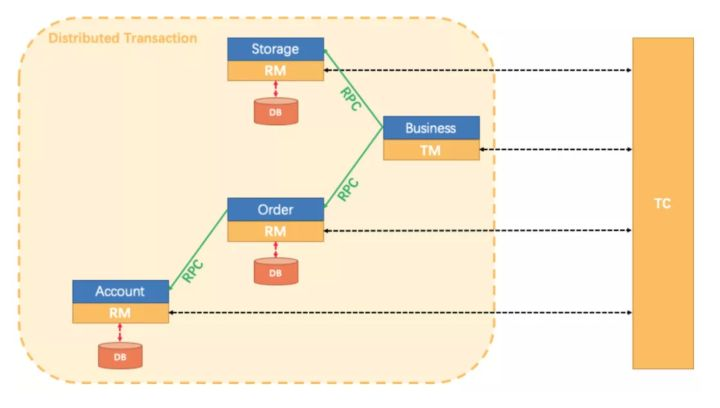

### 2PC（支持 回滚）

适用于多个同时成功或同时失败


### TCC(支持回滚)


### 可靠性消息（不支持回滚）

发送方保证消息发送成功，发送成功之后不可回滚，消费者自己确保消费到消息（消息一旦被发送成功，不可回退，单向的）


### 最大努力通知型（不支持回滚）

发起通知方执行完本地事务后将结果通知给事务参与者，即使事务参与者执行业务处理失败，发起通知方也不会回滚


不适用与不同系统调用


1. 解析SQL，得到sql类型，表名，where条件
2. 查询前镜像
3. 执行业务SQL
4. 查询后镜像
5. 插入回滚日志
6. 提交前，向TC注册：申请行记录的全局锁
7. 业务sql和回滚日志一起提交
8. 将本地事务执行结果上报给TC


一个分布式事务可以拆分为包含若干个分支事务的全局事务，如下图：


基于2PC的分布式事务解决方案在设计上可以分为3部分：

1. TC(Transaction Coordinator) -事务协调者：维护全局和分支事务的状态，驱动全局事务的提交或回滚。
2. TM(Transaction Manager) -事务管理器：定义全局事务的范围：开始全局事务、提交或回滚全局事务。
3. RM(Resource Manager) -RM资源管理器：管理分支事务处理的资源，与TC交互注册分支事务及上报分支事务状态，驱动分支事务提交或回滚。




一个典型的分布式事务过程：

1. TM向TC申请开启一个全局事务，TC创建全局事务成功并返回XID（XID在微服务调用链路上下文中传播）
2. RM执行本地事务，提交事务前，向TC注册分支事务，获取要操作资源的全局锁，如果可以获取锁，将直接返回（否则阻塞），TC将其纳入XID对应全局事务的管理（TC保存分支事务BranchSession到List）
3. RM向TC上报本地事务执行结果


### XA与AT的区别


对于XA事务来说，不管第二阶段是commit还是rollback，事务资源锁都在第二阶段结束后释放，而且XA是锁住了整个库，导致整个库无法执行事务操作。锁的粒度大，严重影响性能。

其实，对于大多数情况，事务最终执行成功并提交的概率是非常大的，而回滚的概率是很小的。seata在第一阶段就将事务提交，并释放本地锁。


T 模式是一种无侵入的分布式事务解决方案。在 AT 模式下，用户只需关注自己的“业务 SQL”，用户的 “业务 SQL” 就是全局事务一阶段，Seata 框架会自动生成事务的二阶段提交和回滚操作。

那么 AT 模式是如何做到对业务无侵入的呢？

首先，应用要使用 Seata 的 JDBC 数据源代理，也就是前面提到的 RM 概念，所有对 DB 的操作都是通过 Seata RM 代理完成。在这层代理中，Seata 会自动控制 SQL 的执行，提交，回滚。下图中绿色部分是 JDBC 数据源的原生实现内容, 黄色部分就是 Seata 的数据源代理


Seata 的 JDBC 数据源代理通过对业务 SQL 的解析，把业务数据在更新前后的数据镜像(beforeImage & afterImage)组织成回滚日志，利用**本地事务**的 ACID 特性，将业务数据的更新和回滚日志的写入在同一个**本地事务**中提交。这样，可以保证：任何提交的业务数据的更新一定有相应的回滚日志存在。

然后，本地事务在提交之前, 还需要通过 RM 向 TC 注册本地分支，这个注册过程中会根据刚才执行的 SQL 拿到所有涉及到的数据主键，以 `resourceId + tableName + rowPK` 作为锁的 key，向 TC 申请所有涉及数据的写锁，当获得所有相关数据的写锁后，再执行本地事务的 Commit 过程。如果有任何一行数据的写锁没有拿到的话，TC 会以 `fastfail` 的方式回复该 RM，RM 会以重试 + 超时机制重复该过程，直到超时。

完成本地事务后，RM 会向 TC 汇报本地事务的执行情况，并完成业务 RPC 的调用过程

**一阶段**


**二阶段**

如果 TM 决议是全局提交，此时分支事务实际上已经完成提交，TC 立刻释放该**全局事务**的所有锁，然后异步调用 RM 清理回滚日志，Phase2 可以非常快速地完成。


如果决议是全局回滚，RM 收到协调器发来的回滚请求，通过 XID 和 Branch ID 找到相应的回滚日志记录，通过回滚记录生成反向的更新 SQL 并执行，以完成分支的回滚。当分支回滚顺利结束时，通知 TC 回滚完成，这时候 TC 才释放该**分支事务**相关的所有锁


这里有一个需要注意的点，RM 在进行回滚时，会先跟 `afterImage` 进行比较： - 如果一致：则执行逆向 SQL - 如果不一致： 再跟 `beforeImage` 进行比较 - 如果一致：说明没必要执行回滚 SQL 了，数据已经恢复了 - 如果不一致：说明出现了脏数据，这时候就抛出异常，需要人工处理

### TCC

TCC 模式需要用户根据自己的业务场景实现 Try、Confirm 和 Cancel 三个操作；事务发起方先在 TC 中注册全局事务，然后在一阶段执行 Try 方法，在二阶段提交的话 TC 会去执行各个 RM 的 Confirm 方法，二阶段回滚则 TC 会去执行各个 RM 的 Cancel 方法。


在 Seata 框架中，每个 TCC 接口对应了一个 Resource，TCC 接口可以是 RPC，也以是服务内 JVM 调用。在业务启动时，Seata 框架会自动扫描识别到 TCC 接口的调用方和发布方。如果是 RPC 的话，就是 sofa:reference、sofa:service、dubbo:reference、dubbo:service 等。

扫描到 TCC 接口的调用方和发布方之后。如果是发布方，会在业务启动时向 TC 注册 TCC Resource，与DataSource Resource 一样，每个资源也会带有一个资源 ID。

与 AT 模式一样，Seata 会给实际方法的执行加切面，该切面会拦截所有对 TCC 接口的调用。在调用 Try 接口时，如果发现处在全局事务中，切面会先向 TC 注册一个分支事务，和 AT 不同的是**TCC 注册分支事务是不加锁的**，注册完成后去执行原来的 RPC 调用。当请求链路调用完成后，TC 通过分支事务的资源 ID 回调到正确的参与者去执行对应 TCC 资源的 Confirm 或 Cancel 方法。

TCC 模式的整体框架相对于 AT 来说更加简单，主要是扫描 TCC 接口，注册资源，拦截接口调用，注册分支事务，最后回调二阶段接口。最核心的实际上是 TCC 接口的实现逻辑。下面我将结合实际的例子，来介绍一下 TCC 模式相较于 AT 模式有什么优势和劣势。

### 使用原则

从 TCC 模型的框架可以发现，TCC 模型的核心在于 TCC 接口的设计。用户在接入 TCC 时，大部分工作都集中在如何实现 TCC 服务上。这就是 TCC 模式最主要的问题，对业务侵入比较大，要花很大的功夫来实现 TCC 服务。

设计一套 TCC 接口最重要的是什么？主要有两点，第一点，需要将操作分成两阶段完成。TCC（Try-Confirm-Cancel）分布式事务模型相对于 XA 等传统模型，其特征在于它不依赖 RM 对分布式事务的支持，而是通过对业务逻辑的分解来实现分布式事务。

TCC 模型认为对于业务系统中一个特定的业务逻辑 ，其对外提供服务时，必须接受一些不确定性，即对业务逻辑初步操作的调用仅是一个临时性操作，调用它的主业务服务保留了后续的取消权。如果主业务服务认为全局事务应该回滚，它会要求取消之前的临时性操作，这就对应从业务服务的取消操作。而当主业务服务认为全局事务应该提交时，它会放弃之前临时性操作的取消权，这对应从业务服务的确认操作。每一个初步操作，最终都会被确认或取消。因此，针对一个具体的业务服务，TCC 分布式事务模型需要业务系统提供三段业务逻辑： 1. 初步操作 Try：完成所有业务检查，预留必须的业务资源。 2. 确认操作 Confirm：真正执行的业务逻辑，不做任何业务检查，只使用 Try 阶段预留的业务资源。因此，只要 Try 操作成功，Confirm 必须能成功。另外，Confirm 操作需满足幂等性，保证一笔分布式事务能且只能成功一次。 3. 取消操作 Cancel：释放 Try 阶段预留的业务资源。同样的，Cancel 操作也需要满足幂等性。

第二点，就是要根据自身的业务模型控制并发，这个对应 ACID 中的隔离性。

### 业务模型

下面我们以金融核心链路里的账务服务来分析一下。首先一个最简化的账务模型就是图中所列，每个用户或商户有一个账户及其可用余额。然后，分析下账务服务的所有业务逻辑操作，无论是交易、充值、转账、退款等，都可以认为是对账户的加钱与扣钱。


因此，我们可以把账务系统拆分成两套 TCC 接口，即两个 TCC Resource，一个是加钱 TCC 接口，一个是扣钱 TCC 接口。

那这两套接口分别需要做什么事情呢？如何将其分成两个阶段完成？下面将会举例说明 TCC 业务模式的设计过程，并逐渐优化。

我们先来看扣钱的 TCC 资源怎么实现。场景为 A 转账 30 元给 B。账户 A 的余额中有 100 元，需要扣除其中 30 元。这里的余额就是所谓的业务资源，按照前面提到的原则，在第一阶段需要检查并预留业务资源，因此，我们在扣钱 TCC 资源的 Try 接口里先检查 A 账户余额是否足够，然后预留余额里的业务资源，即扣除 30 元。


在 Confirm 接口，由于业务资源已经在 Try 接口里扣除掉了，那么在第二阶段的 Confirm 接口里，可以什么都不用做。而在 Cancel 接口里，则需要把 Try 接口里扣除掉的 30 元还给账户。这是一个比较简单的扣钱 TCC 资源的实现，后面会继续优化它。

而在加钱的 TCC 资源里。在第一阶段 Try 接口里不能直接给账户加钱，如果这个时候给账户增加了可用余额，那么在一阶段执行完后，账户里的钱就可以被使用了。但是一阶段执行完以后，有可能是要回滚的。因此，真正加钱的动作需要放在 Confirm 接口里。对于加钱这个动作，第一阶段 Try 接口里不需要预留任何资源，可以设计为空操作。那相应的，Cancel 接口没有资源需要释放，也是一个空操作。只有真正需要提交时，再在 Confirm 接口里给账户增加可用余额。

这就是一个最简单的扣钱和加钱的 TCC 资源的设计。在扣钱 TCC 资源里，Try 接口预留资源扣除余额，Confirm 接口空操作，Cancel 接口释放资源，增加余额。在加钱 TCC 资源里，Try 接口无需预留资源，空操作；Confirm 接口直接增加余额；Cancel 接口无需释放资源，空操作。

### 业务并发模型

之前提到，设计一套 TCC 接口需要有两点，一点是需要拆分业务逻辑成两阶段完成。这个我们已经介绍了。另外一点是要根据自身的业务模型控制并发。

Seata 框架本身仅提供两阶段原子提交协议，保证分布式事务原子性。事务的隔离需要交给业务逻辑来实现。隔离的本质就是控制并发，防止并发事务操作相同资源而引起的结果错乱。

举个例子，比如金融行业里管理用户资金，当用户发起交易时，一般会先检查用户资金，如果资金充足，则扣除相应交易金额，增加卖家资金，完成交易。如果没有事务隔离，用户同时发起两笔交易，两笔交易的检查都认为资金充足，实际上却只够支付一笔交易，结果两笔交易都支付成功，导致资损。

可以发现，并发控制是业务逻辑执行正确的保证，但是像两阶段锁这样的并发访问控制技术要求一直持有数据库资源锁直到整个事务执行结束，特别是在分布式事务架构下，要求持有锁到分布式事务第二阶段执行结束，也就是说，分布式事务会加长资源锁的持有时间，导致并发性能进一步下降。

因此，TCC 模型的隔离性思想就是通过业务的改造，在第一阶段结束之后，从底层数据库资源层面的加锁过渡为上层业务层面的加锁，从而释放底层数据库锁资源，放宽分布式事务锁协议，将锁的粒度降到最低，以最大限度提高业务并发性能。

还是以上面的例子举例，“账户 A 上有 100 元，事务 T1 要扣除其中的 30 元，事务 T2 也要扣除 30 元，出现并发”。在第一阶段 Try 操作中，需要先利用数据库资源层面的加锁，检查账户可用余额，如果余额充足，则预留业务资源，扣除本次交易金额，一阶段结束后，虽然数据库层面资源锁被释放了，但这笔资金被业务隔离，不允许除本事务之外的其它并发事务动用。


并发的事务 T2 在事务 T1 一阶段接口结束释放了数据库层面的资源锁以后，就可以继续操作，跟事务 T1 一样，加锁，检查余额，扣除交易金额。

事务 T1 和 T2 分别扣除的那一部分资金，相互之间无干扰。这样在分布式事务的二阶段，无论 T1 是提交还是回滚，都不会对 T2 产生影响，这样 T1 和 T2 可以在同一个账户上并发执行。

大家可以感受下，一阶段结束以后，实际上采用业务加锁的方式，隔离账户资金，在第一阶段结束后直接释放底层资源锁，该用户和卖家的其他交易都可以立刻并发执行，而不用等到整个分布式事务结束，可以获得更高的并发交易能力。

在这里，TCC 模式和之前说过的 AT 模式区别是： - AT 模式会持有锁到全局事务提交，或在回滚时持有锁直到回滚成功 - TCC 模式一阶段结束就释放锁

想象一下一个业务要调用 A，B，C 三个子服务，如果是采用 AT 模式，那么至少要等 C 结束后，才会释放A，B，C 的相关资源锁，而如果采用 TCC 模式，A 结束就会释放 A 的锁，B 结束就释放 B 的锁...。并发能力一下子就提高了 N 倍，这就是 TCC 相较于 AT 模式的优点————并发能力。

下面我们将会针对业务模型进行优化，大家可以更直观的感受业务加锁的思想。

### 业务模型优化

前面的模型大家肯定会想，为啥一阶段就把钱扣除了？是的。之前只是为了简单说明 TCC 模型的设计思想。在实际中，为了更好的用户体验，在第一阶段，一般不会直接把账户的余额扣除，而是冻结，这样给用户展示的时候，就可以很清晰的知道，哪些是可用余额，哪些是冻结金额。

那业务模型变成什么样了呢？如图所示，需要在业务模型中增加冻结金额字段，用来表示账户有多少金额处以冻结状态。


既然业务模型发生了变化，那扣钱和加钱的 TCC 接口也应该相应的调整。还是以前面的例子来说明。

在扣钱的 TCC 资源里。Try 接口不再是直接扣除账户的可用余额，而是真正的预留资源，冻结部分可用余额，即减少可用余额，增加冻结金额。Confirm 接口也不再是空操作，而是使用 Try 接口预留的业务资源，即将该部分冻结金额扣除；最后在 Cancel 接口里，就是释放预留资源，把 Try 接口的冻结金额扣除，增加账户可用余额。加钱的 TCC资源由于不涉及冻结金额的使用，所以无需更改。

通过这样的优化，可以更直观的感受到 TCC 接口的预留资源、使用资源、释放资源的过程。

那并发控制又变成什么样了呢？跟前面大部分类似，在事务 T1 的第一阶段 Try 操作中，先锁定账户，检查账户可用余额，如果余额充足，则预留业务资源，减少可用余额，增加冻结金额。并发的事务 T2 类似，加锁，检查余额，减少可用余额金额，增加冻结金额。

这里可以发现，事务 T1 和T2 在一阶段执行完成后，都释放了数据库层面的资源锁，但是在各自二阶段的时候，相互之间并无干扰，各自使用本事务内第一阶段 Try 接口内冻结金额即可。这里大家就可以直观感受到，在每个事务的第一阶段，先通过数据库层面的资源锁，预留业务资源，即冻结金额。虽然在一阶段结束以后，数据库层面的资源锁被释放了，但是第二阶段的执行并不会被干扰，这是因为数据库层面资源锁释放以后通过业务隔离的方式为这部分资源加锁，不允许除本事务之外的其它并发事务动用，从而保证该事务的第二阶段能够正确顺利的执行。

通过这两个例子，为大家讲解了怎么去设计一套完备的 TCC 接口。最主要的有两点，一点是将业务逻辑拆分成两个阶段完成，即 Try、Confirm、Cancel 接口。其中 Try 接口检查资源、预留资源、Confirm 使用资源、Cancel 接口释放预留资源。另外一点就是并发控制，采用数据库锁与业务加锁的方式结合。由于业务加锁的特性不影响性能，因此，尽可能降低数据库锁粒度，过渡为业务加锁，从而提高业务并发能力。

### 异常控制

在有了一套完备的 TCC 接口之后，是不是就真的高枕无忧了呢？答案是否定的。在微服务架构下，很有可能出现网络超时、重发，机器宕机等一系列的异常 Case。一旦遇到这些 Case，就会导致我们的分布式事务执行过程出现异常。最常见的主要是这三种异常，分别是空回滚、幂等、悬挂。

因此，TCC 接口里还需要解决这三类异常。实际上，这三类问题可以在 Seata 框架里完成，只不过现在的 Seata 框架还不具备，之后这些异常 Case 的处理会被移植到 Seata 框架里，业务就无需关注这些异常情况，专注于业务逻辑即可。

虽然业务之后无需关心，但是了解一下其内部实现机制，也能更好的排查问题。下面我将为大家一一讲解这三类异常出现的原因以及对应的解决方案。

### 空回滚

首先是空回滚。什么是空回滚？空回滚就是对于一个分布式事务，在没有调用 TCC 资源 Try 方法的情况下，调用了二阶段的 Cancel 方法，Cancel 方法需要识别出这是一个空回滚，然后直接返回成功。

什么样的情形会造成空回滚呢？可以看图中的第 2 步，前面讲过，注册分支事务是在调用 RPC 时，Seata 框架的切面会拦截到该次调用请求，先向 TC 注册一个分支事务，然后才去执行 RPC 调用逻辑。如果 RPC 调用逻辑有问题，比如调用方机器宕机、网络异常，都会造成 RPC 调用失败，即未执行 Try 方法。但是分布式事务已经开启了，需要推进到终态，因此，TC 会回调参与者二阶段 Cancel 接口，从而形成空回滚。


那会不会有空提交呢？理论上来说不会的，如果调用方宕机，那分布式事务默认是回滚的。如果是网络异常，那 RPC 调用失败，发起方应该通知 TC 回滚分布式事务，这里可以看出为什么是理论上的，就是说发起方可以在 RPC 调用失败的情况下依然通知 TC 提交，这时就会发生空提交，这种情况要么是编码问题，要么开发同学明确知道需要这样做。

那怎么解决空回滚呢？前面提到，Cancel 要识别出空回滚，直接返回成功。那关键就是要识别出这个空回滚。思路很简单就是需要知道一阶段是否执行，如果执行了，那就是正常回滚；如果没执行，那就是空回滚。因此，需要一张额外的事务控制表，其中有分布式事务 ID 和分支事务 ID，第一阶段 Try 方法里会插入一条记录，表示一阶段执行了。Cancel 接口里读取该记录，如果该记录存在，则正常回滚；如果该记录不存在，则是空回滚。

### 幂等

接下来是幂等。幂等就是对于同一个分布式事务的同一个分支事务，重复去调用该分支事务的第二阶段接口，因此，要求 TCC 的二阶段 Confirm 和 Cancel 接口保证幂等，不会重复使用或者释放资源。如果幂等控制没有做好，很有可能导致资损等严重问题。

什么样的情形会造成重复提交或回滚？从图中可以看到，提交或回滚是一次 TC 到参与者的网络调用。因此，网络故障、参与者宕机等都有可能造成参与者 TCC 资源实际执行了二阶段防范，但是 TC 没有收到返回结果的情况，这时，TC 就会重复调用，直至调用成功，整个分布式事务结束。


怎么解决重复执行的幂等问题呢？一个简单的思路就是记录每个分支事务的执行状态。在执行前状态，如果已执行，那就不再执行；否则，正常执行。前面在讲空回滚的时候，已经有一张事务控制表了，事务控制表的每条记录关联一个分支事务，那我们完全可以在这张事务控制表上加一个状态字段，用来记录每个分支事务的执行状态。

这个过程有点类似于 AT 模式中的 Undo Log，我们不妨看下 Undo Log 的表结构：

```mysql
CREATE TABLE `undo_log` (
  `id` bigint(20) NOT NULL AUTO_INCREMENT,
  `branch_id` bigint(20) NOT NULL,
  `xid` varchar(100) NOT NULL,
  `context` varchar(128) NOT NULL,
  `rollback_info` longblob NOT NULL,
  `log_status` int(11) NOT NULL,
  `log_created` datetime NOT NULL,
  `log_modified` datetime NOT NULL,
  `ext` varchar(100) DEFAULT NULL,
  PRIMARY KEY (`id`),
  UNIQUE KEY `ux_undo_log` (`xid`,`branch_id`)
) ENGINE=InnoDB AUTO_INCREMENT=1 DEFAULT CHARSET=utf8;
```

我们可以看到，通过该表中`branch_id` 和 `xid` 我们可以确认该条记录对应那个分支事务，然后 `log_status` 可以用来判断该分支事务的执行情况。我们让 `log_status` 有三个值，分别是初始化、已提交、已回滚。Try 方法插入时，是初始化状态。二阶段 Confirm 和 Cancel 方法执行后修改为已提交或已回滚状态。当重复调用二阶段接口时，先获取该事务控制表对应记录，检查状态，如果已执行，则直接返回成功；否则正常执行。

### 悬挂

最后是防悬挂。按照惯例，咱们来先讲讲什么是悬挂。悬挂就是对于一个分布式事务，其二阶段 Cancel 接口比 Try 接口先执行。因为允许空回滚的原因，Cancel 接口认为 Try 接口没执行，空回滚直接返回成功，对于 Seata 框架来说，认为分布式事务的二阶段接口已经执行成功，整个分布式事务就结束了。但是这之后 Try 方法才真正开始执行，预留业务资源，回想一下前面提到事务并发控制的业务加锁，对于一个 Try 方法预留的业务资源，只有该分布式事务才能使用，然而 Seata 框架认为该分布式事务已经结束，也就是说，当出现这种情况时，该分布式事务第一阶段预留的业务资源就再也没有人能够处理了，对于这种情况，我们就称为悬挂，即业务资源预留后没有被继续处理。

什么样的情况会造成悬挂呢？按照前面所讲，在 RPC 调用时，先注册分支事务，再执行 RPC 调用，如果此时 RPC 调用的网络发生拥堵，通常 RPC 调用是有超时时间的，RPC 超时以后，发起方就会通知 TC 回滚该分布式事务，可能回滚完成后，RPC 请求才到达参与者，真正执行，从而造成悬挂。

怎么实现才能做到防悬挂呢？根据悬挂出现的条件先来分析下，悬挂是指二阶段 Cancel 执行完后，一阶段才执行。也就是说，为了避免悬挂，如果二阶段执行完成，那一阶段就不能再继续执行。因此，当一阶段执行时，需要先检查二阶段是否已经执行完成，如果已经执行，则一阶段不再执行；否则可以正常执行。那怎么检查二阶段是否已经执行呢？大家是否想到了刚才解决空回滚和幂等时用到的事务控制表，可以在二阶段执行时插入一条事务控制记录，状态为已回滚，这样当一阶段执行时，先读取该记录，如果记录存在，就认为二阶段已经执行；否则二阶段没执行。

### 异常控制实现

在分析完空回滚、幂等、悬挂等异常 Case 的成因以及解决方案以后，下面我们就综合起来考虑，一个 TCC 接口如何完整的解决这三个问题。

首先是 Try 方法。结合前面讲到空回滚和悬挂异常，Try 方法主要需要考虑两个问题，一个是 Try 方法需要能够告诉二阶段接口，已经预留业务资源成功。第二个是需要检查第二阶段是否已经执行完成，如果已完成，则不再执行。因此，Try 方法的逻辑可以如图所示：


先插入事务控制表记录，如果插入成功，说明第二阶段还没有执行，可以继续执行第一阶段。如果插入失败，则说明第二阶段已经执行或正在执行，则抛出异常，终止即可。

接下来是 Confirm 方法。因为 Confirm 方法不允许空回滚，也就是说，Confirm 方法一定要在 Try 方法之后执行。因此，Confirm 方法只需要关注重复提交的问题。可以先锁定事务记录，如果事务记录为空，则说明是一个空提交，不允许，终止执行。如果事务记录不为空，则继续检查状态是否为初始化，如果是，则说明一阶段正确执行，那二阶段正常执行即可。如果状态是已提交，则认为是重复提交，直接返回成功即可；如果状态是已回滚，也是一个异常，一个已回滚的事务，不能重新提交，需要能够拦截到这种异常情况，并报警。

最后是 Cancel 方法。因为 Cancel 方法允许空回滚，并且要在先执行的情况下，让 Try 方法感知到 Cancel 已经执行，所以和 Confirm 方法略有不同。首先依然是锁定事务记录。如果事务记录为空，则认为 Try 方法还没执行，即是空回滚。空回滚的情况下，应该先插入一条事务记录，确保后续的 Try 方法不会再执行。如果插入成功，则说明 Try 方法还没有执行，空回滚继续执行。如果插入失败，则认为Try 方法正在执行，等待 TC 的重试即可。如果一开始读取事务记录不为空，则说明 Try 方法已经执行完毕，再检查状态是否为初始化，如果是，则还没有执行过其他二阶段方法，正常执行 Cancel 逻辑。如果状态为已回滚，则说明这是重复调用，允许幂等，直接返回成功即可。如果状态为已提交，则同样是一个异常，一个已提交的事务，不能再次回滚。

通过这一部分的讲解，大家应该对 TCC 模型下最常见的三类异常 Case，空回滚、幂等、悬挂的成因有所了解，也从实际例子中知道了怎么解决这三类异常，在解决了这三类异常的情况下，我们的 TCC 接口设计就是比较完备的了。虽然现在 Seata 框架中上述方案尚未实装，但是以后一定会实装的，到那时会由 Seata 框架来完成异常的处理，开发 TCC 接口的同学就不再需要关心了。


### AT事务

### 前提

* 基于支持本地ACID特性的关系型数据库
* java应用，使用jdbc访问数据库

### 整体机制

2PC的演变：

* 一阶段：业务数据和回滚记录在同一个事务中提交，释放本地锁和连接资源
* 二阶段
  * 提交异步化，速度很快
  * 回滚通过一阶段的回滚日志进行反向补偿

### 写隔离

* 一阶段本地事务提交前，必须获得全局锁
* 拿不到全局锁，不能执行提交本地事务
* 拿全局锁的尝试限定在一定范围内，超出范围将放弃，并回滚本地事务，释放本地锁


### XA事务的限制

* XA事务与本地事务和锁表操作是互斥的

  * 开启XA事务后无法开启本地事务，反之亦然

    

  * XA事务与锁表操作互斥

    

    

* XA事务命令的顺序一致的

  ```mysql
  xa start 事务id;
  业务sql
  xa end  事务id;
  xa prepare 事务id;
  xa commit 事务id; 或  xa rollback 事务id;
  # 如
  # xa start 'xatest';
  # update t_user set name = 'fadsfa' WHERE id=1;
  # xa end 'xatest';
  # xa PREPARE 'xatest';
  # xa COMMIT 'xatest';
  # xa rollback 'xatest';
  ```

### 


一个分布式事务可以拆分为包含若干个分支事务的全局事务

