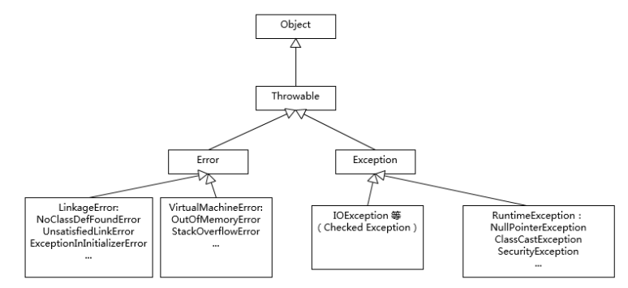

### 1. 谈谈你对JAVA的认识

#### 2个特性

1. 一次编写，到处执行（通过字节码和JVM这种跨平台的抽象，屏蔽了硬件和操作系统的细节，是一次编写，到处执行的基础）
2. 垃圾收集，通过垃圾收集器回收内存，大部分情况下，程序员无需关心内存的分配与回收。

#### Java是解释执行的？

这种说法不太准确。我们开发的Java源代码，首先通过javac编译为字节码，然后在运行时，JVM通过内嵌的解释器将字节码转换为最终的机器码。但常用的JVM中，如hotspot虚拟机中都提供了JIT（Java-In-Time）编译器，也就是通常说的动态编译，JIT可以在运行时将热点代码（通常有2种方法判断代码是否为热点代码：采样和计数器方式）编译为机器码，这种情况下，部分热点代码就属于**编译执行**，而不是解释执行了

#### 解释和编译模式

在运行时，JVM通过类加载器加载字节码，然后解释或编译执行。JDK8中默认使用解释和编译混合的方式（-Xmixed）。通常运行在 server 模式的 JVM，会进行上万次调用以收集足够的信息进行高效的编译，client 模式这个门限是 1500 次。Oracle Hotspot JVM 内置了两个不同的 JIT compiler，C1 对应前面说的 client 模式，适用于对于启动速度敏感的应用，比如普通 Java 桌面应用；C2 对应 server 模式，它的优化是为长时间运行的服务器端应用设计的。

### 2. Exception与Error有什么区别？



Exception和Error都继承自Throwable，在Java中只有  Throwable类型的实例才可以被抛出和捕获，它是异常处理机制的基本组成。

Exception和Error体现了Java平台设计者对不同异常的分类。Exception是程序正常运行过程中，可以预料的意外情况，可能并且应该被捕获，进行相应处理。Error是指在正常情况下，不大可能出现的情况。绝大多数异常都会导致程序处于非正常、不可恢复的状态。因为是非正常情况，所以一般不需要捕获。常见的OutOfMemoryError就是Error的子类。

Exception又可以分为**可检查异常**和**不检查异常**，可检查异常必须在代码中显式捕获，这是编译期检查的一部分。不检查异常即运行时异常，如空指针。

##### 如何正确使用？

1. 绝大多数情况下，不要Swallow异常
2. 分层级捕获，不要只捕获Exception类型异常
3. 不要使用e.printStackTrace()，而是将异常输出到日志
4. 出现问题，第一时间抛出异常，更容易排查问题

### 3. 谈谈final、finally、 finalize有什么不同？

final可以用来修饰类、方法、成员变量。修饰类时表示这个类不可以继承，修饰方法时表示这个方法不可以被重写，修饰变量时表示这个变量不可以修改。

finally则是Java中保证重点代码一定会被执行的机制。可以使用try...finally或try...catch...finally来关闭JDBC连接，unlock释放锁等。

finalize是Object类中的方法，它的设计目的是保证对象在被垃圾收集之前完成特定资源的回收，finalize机制一斤不被推荐使用，在JDK9中被标记为deprecated。

下面这段代码中的finally中的代码是否会执行？

```java
try {
// do something
System.exit(1);
} finally{
System.out.println(“Print from finally”);  //不会执行
}
```

对于 finalize，我们要明确它是不推荐使用的，业界实践一再证明它不是个好的办法。如果没有特别的原因，不要实现 finalize 方法，也不要指望利用它来进行资源回收。

为什么呢？简单说，你无法保证 finalize 什么时候执行，执行的是否符合预期。使用不当会影响性能，导致程序死锁、挂起等。

注意：

1. final不是immutable！因为final只是不允许引用发生改变。比如使用Arrays.asList(arr)，可以通过修改底层数组修改list数据。
2. 


